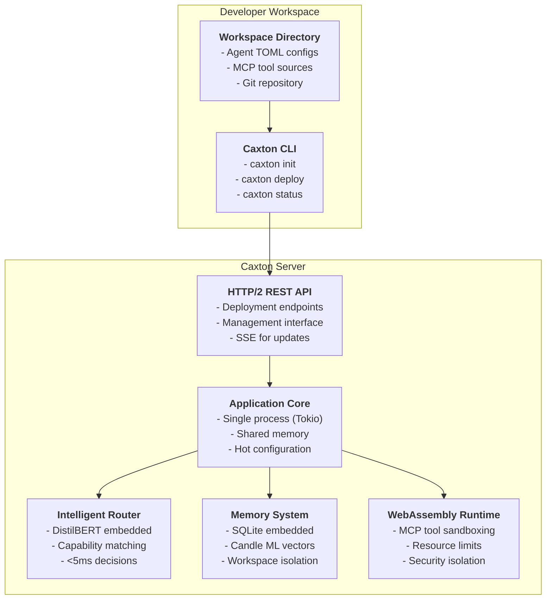
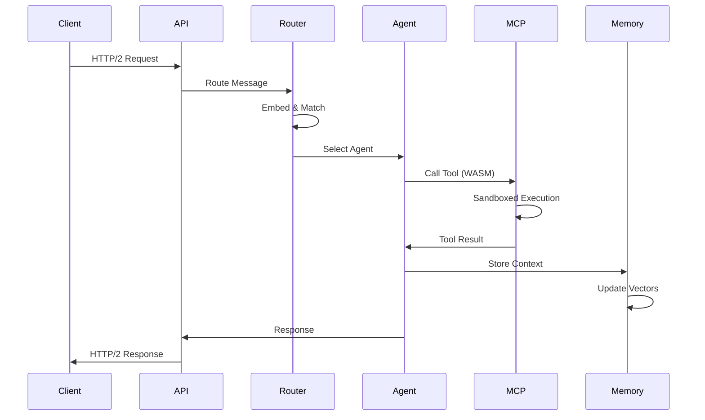

# Caxton System Architecture

**Document Version**: 1.0
**Date**: 2025-09-16
**Status**: Architecture Synthesis from ADRs
**Technical Architect**: technical-architect

## Executive Summary

Caxton is an agent orchestration application server that enables developers to create, deploy, and manage AI agents within 5-10 minutes. This architecture document synthesizes 46 Architecture Decision Records (ADRs) into a cohesive system design that balances simplicity, performance, and production readiness.

The architecture centers on three key principles:

1. **Configuration-driven agents** - TOML files, not code compilation (ADR-0028)
2. **Embedded everything** - Single binary with zero external dependencies (ADR-0030)
3. **Manual deployment control** - Explicit `caxton deploy` commands (ADR-0043)

## System Overview



## Core Architecture Decisions

### 1. Application Server Model (ADR-0001, ADR-0036)

**Decision**: Single-process application server with all components embedded in one binary.

**Architecture**:

- **Process Model**: Single OS process using Tokio async runtime
- **Concurrency**: Async request handling with shared memory state
- **Components**: SQLite, Candle ML, DistilBERT all embedded
- **Performance**: Zero IPC overhead, <5ms routing decisions
- **Deployment**: Single binary achieves 5-10 minute setup promise

**Trade-offs**:

- ✅ Simple deployment and operations
- ✅ Maximum performance through shared memory
- ✅ No external dependencies
- ❌ All agents fail together (mitigated by supervisor)
- ❌ Single-node scaling limit (addressed post-MVP)

### 2. Configuration-Driven Agents (ADR-0028, ADR-0038)

**Decision**: Agents are TOML configuration files with embedded templates for rapid creation.

**Architecture**:

```toml
# Example agent configuration
[agent]
id = "data-analyzer"
name = "Data Analysis Agent"
version = "1.0.0"

[capabilities]
patterns = ["analyze data", "generate reports", "statistical analysis"]

[prompts]
system = """
You are a data analysis expert. You help users understand their data
through statistical analysis and clear visualizations.
"""

[tools]
required = ["data-reader", "chart-generator", "stats-calculator"]
```

**Template System**:

- 10 embedded templates in binary (ADR-0038)
- `caxton init my-agent --template data-analyzer`
- Simple variable substitution, no external engine
- Templates validated at compile-time

### 3. Manual Deployment Model (ADR-0043, ADR-0044, ADR-0045, ADR-0046)

**Decision**: Explicit deployment control through `caxton deploy` command with incremental updates.

**Deployment Workflow**:

```bash
# 1. Start server (long-running)
caxton serve

# 2. Initialize workspace
caxton init my-workspace
cd my-workspace

# 3. Create agents
caxton init coordinator --template task-coordinator
caxton init analyzer --template data-analyzer

# 4. Deploy to server (explicit command)
caxton deploy

# 5. Check status (works offline)
caxton status
```

**Incremental Deployment Protocol**:

- **Change Detection**: SHA-256 checksums in Merkle tree structure
- **Network Efficiency**: Only transmit changed bytes using binary diffs
- **Performance Targets**:
  - Single agent: < 500ms
  - 5-10 agents: < 2s
  - 50+ agents: < 5s
- **Atomic Updates**: All-or-nothing with automatic rollback
- **Git Integration**: Every deployment tracks commit hash

**State Management**:

- **Workspace State**: Local development with Git tracking
- **Server State**: Deployed configurations with version history
- **Conflict Detection**: Version numbers prevent accidental overwrites
- **Audit Trail**: Complete deployment log with who/what/when/commit

### 4. Communication Protocol (ADR-0046, ADR-0026)

**Decision**: HTTP/2 with REST API patterns and JSON payloads.

**Protocol Stack**:

```yaml
Transport: HTTP/2 over TLS 1.3
- Binary framing for efficiency
- Header compression (HPACK)
- Stream multiplexing
- Server push capabilities

API Style: RESTful resources
- Standard HTTP verbs
- Resource URLs: /api/v1/workspaces/{id}/agents
- JSON request/response bodies
- Server-Sent Events for real-time updates

Security:
- Bearer tokens (JWT) with workspace claims
- TLS 1.3 minimum
- Workspace-scoped permissions
```

**Key Endpoints**:

- `POST /api/v1/workspaces/{id}/deploy` - Deploy configuration changes
- `GET /api/v1/workspaces/{id}/status` - Get deployment status
- `GET /api/v1/workspaces/{id}/events` - SSE for real-time updates

### 5. Intelligent Routing (ADR-0037, ADR-0029)

**Decision**: Embedded DistilBERT for capability-based routing without external services.

**Routing Architecture**:

- **Model**: DistilBERT embedded in binary (~65MB)
- **Vectors**: All-MiniLM-L6-v2 for semantic similarity
- **Performance**: <5ms routing decisions
- **Caching**: Route decisions cached for common patterns
- **Fallback**: Keyword matching if ML inference fails

**Capability Matching Process**:

```
User Message → Vector Embedding → Semantic Search
    ↓                                    ↓
Agent Capabilities ← Similarity Score ← Top K Results
    ↓
Selected Agent ← Score Threshold Check
```

### 6. Memory System (ADR-0030, ADR-0035)

**Decision**: Embedded SQLite with Candle ML for vector operations.

**Memory Architecture**:

- **Storage**: SQLite database per workspace
- **Vectors**: Candle ML for embeddings (no FAISS/external DB)
- **Isolation**: Complete workspace separation
- **Search**: Hybrid keyword + semantic (10-50ms for 100K entities)
- **Persistence**: Local development vs deployed are separate

**Data Model**:

```sql
-- Core memory schema
CREATE TABLE entities (
    id TEXT PRIMARY KEY,
    workspace_id TEXT NOT NULL,
    content TEXT NOT NULL,
    embedding BLOB,  -- Candle vector
    metadata JSON,
    created_at TIMESTAMP,
    INDEX idx_workspace (workspace_id)
);

CREATE TABLE relationships (
    from_id TEXT,
    to_id TEXT,
    relationship_type TEXT,
    workspace_id TEXT,
    metadata JSON,
    PRIMARY KEY (from_id, to_id, relationship_type)
);
```

### 7. Security Model (ADR-0002, ADR-0016)

**Decision**: Hybrid security with configuration agents in host runtime, MCP tools in WebAssembly.

**Security Layers**:

```
Configuration Agents (TOML):
- Run in host process (trusted)
- Resource limits via cgroups
- Capability restrictions
- No direct system access

MCP Tools (WebAssembly):
- Full WASM sandboxing
- Memory limits enforced
- No filesystem access
- Network access controlled
- CPU time limits
```

**Authentication & Authorization**:

- JWT tokens with workspace claims
- Workspace-level isolation
- Role-based access control
- API rate limiting

### 8. LLM Integration (ADR-0040)

**Decision**: LLM providers abstracted as MCP tools for runtime flexibility.

**LLM Architecture**:

- **No Built-in Models**: LLMs are external MCP tools
- **Provider Agnostic**: OpenAI, Anthropic, local models all supported
- **Configuration-Based**: Agents specify required LLM capabilities
- **Fallback Chains**: Multiple providers with automatic failover
- **Cost Controls**: Token limits and budget tracking

## System Components

### CLI Tool (ADR-0009)

The Caxton CLI provides the primary interface for developers:

**Core Commands**:

- `caxton init` - Create new workspace or agent from template
- `caxton serve` - Start local server
- `caxton deploy` - Deploy configurations to server
- `caxton status` - Check deployment status (works offline)
- `caxton pull` - Retrieve server configurations
- `caxton log` - View deployment history

**Design Principles**:

- Predictable command structure
- Comprehensive help system
- Progress indicators for long operations
- Clear error messages with remediation
- Offline-capable where possible

### Agent Lifecycle

**1. Creation Phase**:

```bash
# Template-based creation
caxton init my-agent --template data-analyzer

# Creates:
my-agent/
├── agent.toml          # Configuration
├── README.md          # Customization guide
├── prompts/           # System/user prompts
└── examples/          # Example usage
```

**2. Development Phase**:

- Edit TOML configuration locally
- Test with local server instance
- Iterate quickly without compilation
- Git commit for version tracking

**3. Deployment Phase**:

```bash
# Check what will be deployed
caxton status

# Deploy to server
caxton deploy
> Analyzing changes...
> Found 2 modified configurations
> Deploying to https://caxton.example.com
> ✓ Deployed successfully (384ms)
> Git commit: abc123def
> Deployment ID: 550e8400-e29b
```

**4. Runtime Phase**:

- Agents loaded on-demand (function-as-a-service)
- No persistent agent processes
- Stateless configuration execution
- Automatic reload on deployment

### Message Flow

**Complete Request Lifecycle**:



## Performance Architecture

### Design Targets

Based on ADR requirements and EVENT_MODEL specifications:

| Operation            | Target  | Implementation                        |
| -------------------- | ------- | ------------------------------------- |
| Agent routing        | <5ms    | Embedded DistilBERT with caching      |
| Single agent deploy  | <500ms  | Incremental checksums + binary diff   |
| 5-10 agent deploy    | <2s     | Parallel validation + batched apply   |
| Memory search (100K) | 10-50ms | SQLite FTS5 + Candle vectors          |
| Configuration reload | <100ms  | In-memory TOML parsing                |
| HTTP/2 round-trip    | <50ms   | Persistent connections + multiplexing |

### Optimization Strategies

**1. Zero-Copy Operations**:

- Shared memory between components
- Reference counting for large data
- Tokio async without thread copies

**2. Intelligent Caching**:

- Parsed configurations cached
- Route decisions memoized
- Vector embeddings pre-computed

**3. Incremental Updates**:

- Checksum-based change detection
- Binary diffs for large files
- Atomic swap for configuration

## Deployment Architecture

### Local Development

```bash
# Development workflow
workspace/
├── .git/                 # Required for deployment
├── caxton.toml          # Workspace configuration
├── agents/              # Agent configurations
│   ├── coordinator.toml
│   └── analyzer.toml
└── tools/               # MCP tool sources
    └── data-reader/
```

### Production Deployment

```bash
# Production server setup
/opt/caxton/
├── caxton              # Single binary
├── config.toml         # Server configuration
├── data/               # SQLite databases
│   └── workspaces/
│       └── {workspace-id}.db
└── logs/               # Operational logs
```

### High Availability Considerations

While MVP focuses on single-node deployment (ADR-0035), the architecture supports future clustering:

**Future HA Path**:

- Deployment log replication
- Configuration consensus via Raft
- Session affinity for workspaces
- Read replicas for memory system
- Active-passive failover

## Security Architecture

### Defense in Depth

**Layer 1: Network Security**

- TLS 1.3 minimum
- Certificate pinning optional
- Rate limiting per workspace

**Layer 2: Authentication**

- JWT tokens with expiry
- Workspace-scoped claims
- Token refresh mechanism

**Layer 3: Process Isolation**

- WebAssembly for untrusted code
- Resource limits (CPU, memory, disk)
- No direct filesystem access

**Layer 4: Data Protection**

- Workspace isolation in SQLite
- Encrypted sensitive configuration
- Audit logging for compliance

## Operational Excellence

### Observability (ADR-0001)

**Metrics** (Prometheus format):

- Request latency histograms
- Agent invocation counts
- Memory usage gauges
- Deployment success rates

**Logging** (Structured JSON):

- Request/response traces
- Deployment operations
- Error conditions
- Security events

**Tracing** (OpenTelemetry):

- Distributed request tracking
- Cross-component correlation
- Performance bottleneck identification

### Monitoring Dashboards

**Key Metrics to Track**:

1. **Deployment Health**: Success rate, duration, conflicts
2. **Agent Performance**: Invocation latency, error rates
3. **System Resources**: CPU, memory, disk, network
4. **Security Events**: Auth failures, rate limit hits

## Migration Path

### From Prototype to Production

**Phase 1: Local Development** (Current)

- Single workspace
- Local SQLite
- Development server
- Manual deployment

**Phase 2: Team Deployment** (Next)

- Multiple workspaces
- Shared server
- Git integration
- Deployment conflicts

**Phase 3: Production Scale** (Future)

- High availability
- Backup/restore
- Monitoring/alerting
- Compliance logging

## Architecture Trade-offs

### What We Optimized For

1. **Simplicity over Flexibility**
   - Single binary vs microservices
   - TOML config vs full programming
   - Manual deploy vs automatic sync

2. **Speed over Scale**
   - Shared memory vs distributed
   - Embedded components vs external
   - Single-node vs clustering

3. **Developer Experience over Power**
   - 5-10 minute setup vs advanced features
   - Templates vs custom development
   - Configuration vs compilation

### What We Deferred

1. **Clustering** - Single-node first, distributed later
2. **Custom Templates** - Fixed set of 10 for quality
3. **Automatic Rollback** - Forward-only deployments
4. **Cross-Workspace Communication** - Isolated by design

## Success Metrics

The architecture achieves its goals when:

1. **5-10 Minute Experience**: New users deploy working agents in under 10 minutes
2. **Zero Dependencies**: Single binary runs without external services
3. **Production Ready**: Handles real workloads with <5ms routing
4. **Developer Friendly**: Clear errors, good docs, predictable behavior
5. **Secure by Default**: WebAssembly isolation, workspace separation

## Conclusion

This architecture represents a cohesive synthesis of 46 architectural decisions, creating a system that balances:

- **Simplicity** through configuration-driven design
- **Performance** through embedded components
- **Security** through WebAssembly isolation
- **Usability** through template-based creation
- **Control** through manual deployment

The result is an agent orchestration platform that delivers on its core promise: enabling developers to create and deploy AI agents in 5-10 minutes, without sacrificing production readiness or security.

## References

### Core Architecture ADRs

- ADR-0001: Application Server Architecture
- ADR-0028: Configuration-Driven Agent Architecture
- ADR-0030: Embedded Memory System
- ADR-0043: Manual Deployment Commands

### Supporting ADRs

- ADR-0002: WebAssembly Isolation
- ADR-0009: CLI Tool Design
- ADR-0016: Security Architecture
- ADR-0026: REST API Protocol
- ADR-0029: FIPA-ACL Lightweight Messaging
- ADR-0035: Single-Node Memory Architecture
- ADR-0036: Shared Process Model
- ADR-0037: Embedded Routing Model
- ADR-0038: Template-Based Agent Creation
- ADR-0040: LLM Providers as MCP Tools
- ADR-0044: Incremental Deployment Strategy
- ADR-0045: Configuration State Management
- ADR-0046: Server Communication Protocol

### Requirements Documentation

- REQUIREMENTS_ANALYSIS.md v1.1
- EVENT_MODEL.md v2.1
- PLANNING.md (User Stories)
