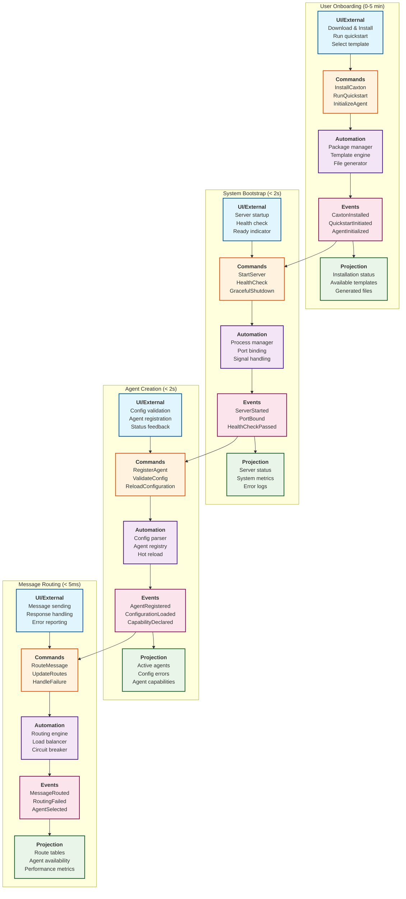

# Caxton Event Model

**Document Version**: 2.1
**Date**: 2025-09-16
**Status**: Updated Deployment Model - Manual Deploy Command Pattern
**Technical Architect**: technical-architect
**Contributors**: product-manager, ux-ui-design-expert
**Methodology**: [Event Modeling Cheatsheet](https://eventmodeling.org/posts/event-modeling-cheatsheet/)

## Executive Summary

This Event Model captures the complete system behavior of Caxton as an agent
orchestration application server, with particular emphasis on the **5-10 minute
onboarding experience** and the **manual deployment command pattern**.

**Critical Update (v2.1)**: The deployment model has been corrected from automatic
hot reload to a manual `caxton deploy` command pattern. This gives developers
explicit control over when configuration changes go live, similar to Docker or
Kubernetes deployment workflows. The model ensures technical feasibility while
centering the user experience and business value.

## Event Modeling Principles

Following the Event Modeling methodology:

- **Events** are immutable facts about what happened (past tense)
- **Commands** are user intentions that may succeed or fail
- **Views/Read Models** are projections of events for specific uses
- **Workflows** connect events to subsequent commands
- **Timeline** shows the temporal sequence of system evolution

## System Timeline Overview

The following diagram shows the vertical slices of functionality using proper event modeling swimlanes:



### Vertical Slice Descriptions

**User Onboarding (0-5 min)**: Complete developer onboarding from installation to first working agent, emphasizing the 5-10 minute promise from ADR-0041.

**System Bootstrap (< 2s)**: Server initialization and readiness verification, ensuring rapid startup for development iterations.

**Agent Creation (< 2s)**: Configuration-driven agent registration and capability declaration following ADR-0028 patterns.

**Message Routing (< 5ms)**: High-performance capability-based message routing with automatic load balancing and fault tolerance.

### Performance Targets

| Vertical Slice   | Time Budget | Success Criteria                             |
| ---------------- | ----------- | -------------------------------------------- |
| User Onboarding  | 0-5 minutes | First working agent deployed and tested      |
| System Bootstrap | < 2 seconds | Server responding to health checks           |
| Agent Creation   | < 2 seconds | Configuration validated and agent registered |
| Message Routing  | < 5ms       | Message routed to appropriate agent          |

### Key Milestones

- **Minute 0-1**: Download and install Caxton
- **Minute 1-2**: Run `caxton init` with template selection
- **Minute 2-3**: Review generated configuration
- **Minute 3-5**: Customize for specific use case
- **Minute 5-6**: Start agent with `caxton serve`
- **Minute 6-7**: Test with first request
- **Minute 7-10**: Iterate and see results

## Phase 0: User Onboarding Journey (Critical for 5-10 Minute Promise)

### Commands

```yaml
InstallCaxton:
  input:
    platform: Platform
    installation_method: Binary | Cargo | Docker
  produces:
    - CaxtonInstalled (success)
    - InstallationFailed (failure)
  user_experience:
    feedback: |
      "Installing Caxton..." → Progress bar → "✓ Caxton installed successfully!"
    time_budget: 30-60 seconds

RunQuickstart:
  input:
    user_type: FirstTime | Returning
  produces:
    - QuickstartInitiated
    - OnboardingMilestoneReached
  user_experience:
    feedback: Interactive welcome message with clear next steps
    time_budget: 5 seconds

InitializeAgent:
  input:
    agent_name: String
    template: TemplateId?
    interactive: Boolean
  validation:
    - agent_name is valid identifier
    - directory doesn't exist or --force
  produces:
    - AgentInitialized (success)
    - InitializationFailed (failure)
  user_experience:
    feedback: Real-time progress with file creation messages
    time_budget: < 2 seconds

SelectTemplate:
  input:
    search_filter: String?
  produces:
    - TemplateSelected
    - TemplateSelectionCancelled
  user_experience:
    feedback: Interactive list with descriptions and use cases
    preview: Shows template structure before selection
    time_budget: 10-30 seconds (user thinking time)
```

### Events

```yaml
CaxtonInstalled:
  timestamp: DateTime
  version: Version
  platform: Platform
  installation_path: Path
  first_time_user: Boolean

FirstTimeUserDetected:
  timestamp: DateTime
  triggers: OnboardingFlow
  show_welcome: Boolean

QuickstartInitiated:
  timestamp: DateTime
  user_type: FirstTime | Returning
  selected_path: GuidedSetup | Documentation | DirectUsage

OnboardingMilestoneReached:
  timestamp: DateTime
  milestone: MilestoneName
  time_elapsed: Duration
  milestones:
    - InstallationComplete (0-1 min)
    - FirstAgentCreated (1-2 min)
    - TemplateSelected (2-3 min)
    - ConfigurationCustomized (3-5 min)
    - AgentStarted (5-6 min)
    - FirstRequestProcessed (6-7 min)
    - SuccessAchieved (7-10 min)

TemplateSelected:
  timestamp: DateTime
  template_id: TemplateId
  template_name: String
  category: TemplateCategory
  preview_shown: Boolean

AgentInitialized:
  timestamp: DateTime
  agent_name: String
  template_used: TemplateId?
  files_created: [FilePath]
  next_steps_shown: Boolean
  success_message:
    String
    # e.g., "✓ Agent 'my-analyzer' created! Run: caxton agent start my-analyzer"

InitializationFailed:
  timestamp: DateTime
  reason: FailureReason
  user_message: String # User-friendly explanation
  suggested_actions: [String] # Actionable recovery steps
  help_command: String # e.g., "Run 'caxton help init' for more information"
```

### Views

```yaml
OnboardingProgress:
  projection_of: [OnboardingMilestoneReached, AgentInitialized]
  fields:
    current_milestone: MilestoneName
    completed_milestones: [MilestoneName]
    total_time_elapsed: Duration
    estimated_time_remaining: Duration
    success_indicators: [String]

TemplateGallery:
  projection_of: [TemplateMetadataLoaded]
  fields:
    templates: [TemplateInfo]
    categories: Map<Category, [TemplateId]>
    popular_templates: [TemplateId] # Top 5 most used

TemplateInfo:
  template_id: TemplateId
  name: String
  description: String
  category: Category
  use_cases: [String]
  complexity: Beginner | Intermediate | Advanced
  estimated_setup_time: Duration
  preview_available: Boolean

UserJourneyMetrics:
  projection_of: [OnboardingMilestoneReached, FirstTimeUserDetected]
  fields:
    total_installations: Count
    first_time_users: Count
    milestone_completion_rates: Map<MilestoneName, Percentage>
    avg_time_to_milestone: Map<MilestoneName, Duration>
    abandonment_points: Map<MilestoneName, Count>
```

### Workflows

```yaml
FirstTimeUserOnboarding:
  trigger: FirstTimeUserDetected
  steps: 1. ShowWelcomeMessage
    2. OfferQuickstartChoice
    3. GuideTemplateSelection
    4. CreateFirstAgent
    5. ShowNextSteps
  produces: OnboardingMilestoneReached(events)
  success_criteria:
    - User creates working agent in < 10 minutes
    - User successfully processes first request

TemplatePreview:
  trigger: UserHoversOnTemplate | UserSelectsPreview
  action: ShowTemplateStructure
  produces: TemplatePreviewShown
  includes:
    - File structure
    - Configuration highlights
    - Example use cases
    - Customization points

InteractiveTemplateSelection:
  trigger: InitializeAgent(no template specified)
  steps: 1. ShowTemplateGallery
    2. AllowFiltering/Searching
    3. ShowPreview
    4. ConfirmSelection
  produces: TemplateSelected
  fallback: DefaultTemplate(task-automator)

SuccessCelebration:
  trigger: FirstRequestProcessed
  condition: is_first_time_user
  action: ShowSuccessMessage
  produces: OnboardingComplete
  message: |
    "🎉 Congratulations! You've created your first Caxton agent in
    {time_elapsed}!"
```

## Phase 1.5: Deployment Model (STORY-003 Update)

This phase represents the corrected deployment model based on requirements clarification. The deployment workflow follows a manual command pattern similar to Docker/Kubernetes, giving developers explicit control over when changes go live.

### Deployment Workflow Overview

```yaml
DeveloperWorkflow:
  1. Start Server Once:
    command: "caxton serve"
    behavior: Long-running process
    result: Server ready to receive deployments

  2. Edit Configurations:
    location: Workspace directory
    files: agent.toml files
    validation: Local syntax checking

  3. Deploy Changes:
    command: "caxton deploy"
    behavior: Push changes to running server
    performance: < 500ms single, < 2s for 5-10 agents
    result: Agents updated without server restart

  4. Check Status:
    command: "caxton status"
    behavior: Show pending changes
    offline: Works with cached state
```

### Key Design Decisions

```yaml
IncrementalDeployment:
  description: Only changed configurations are deployed
  detection: SHA256 checksums of config files
  optimization: Delta transmission, parallel updates
  performance: Sub-second for typical changes

AtomicUpdates:
  description: All-or-nothing deployment semantics
  behavior: Validate all → Deploy all → Rollback on failure
  guarantee: No partial deployments
  isolation: Other agents continue running

OfflineCapability:
  description: Status works without server connection
  implementation: Local cache of deployed state
  update: Cache refreshed after each deployment
  benefit: Fast feedback during development
```

### Performance Requirements

```yaml
DeploymentPerformance:
  single_agent:
    target: < 500ms
    includes: Validation, transmission, activation

  small_workspace: # 5-10 agents
    target: < 2 seconds
    optimization: Parallel deployment

  large_workspace: # 50+ agents
    target: < 5 seconds
    optimization: Batch processing, connection pooling

ChangeDetection:
  workspace_scan: < 200ms for 100 files
  checksum_computation: < 5ms per file
  diff_generation: < 50ms per changed file
  cache_lookup: < 10ms
```

## Phase 1: System Bootstrap

### Commands

```yaml
StartServer:
  input:
    config_file: Path
    port: Port
    log_level: LogLevel
  validation:
    - config_file exists and is valid TOML
    - port is available
  produces:
    - CaxtonReady (success)
    - ServerStartFailed (failure)
  user_experience:
    acknowledgment: < 100ms response "Starting Caxton server..."
    progress: Show initialization steps in real-time
    success: "✓ Caxton ready on port {port}"
```

### Events

```yaml
CaxtonReady: # User-friendly naming vs "ServerStarted"
  timestamp: DateTime
  server_id: ServerId
  config:
    port: Port
    routing_mode: RoutingMode
    memory_backend: MemoryBackend
  metadata:
    version: Version
    git_commit: CommitHash
  startup_time_ms: Duration
  user_message: "Caxton is ready to orchestrate your agents!"

ServerStartFailed:
  timestamp: DateTime
  reason: StartupError
  details: String
  user_message: String # User-friendly error message
  suggested_actions: [String] # How to fix the problem
  help_reference: String # Link to docs or help command

CommandAcknowledged: # CLI feedback pattern
  timestamp: DateTime
  command: String
  response_time_ms: Duration # Must be < 100ms
  initial_feedback: String # Immediate user feedback

ProgressUpdate: # For long-running operations
  timestamp: DateTime
  operation: String
  percent_complete: Percentage
  current_step: String
  estimated_remaining: Duration?
```

### Views

```yaml
ServerStatus:
  projection_of: [ServerStarted, ServerStopped, HealthCheckPerformed]
  fields:
    server_id: ServerId
    status: Running | Stopped | Unhealthy
    uptime: Duration
    current_config: Config
    health_metrics: HealthMetrics
```

### Workflows

```yaml
ServerHealthMonitoring:
  trigger: ServerStarted
  schedule: Every(30 seconds)
  action: PerformHealthCheck
  produces: HealthCheckPerformed
```

## Phase 2: Agent Deployment and Configuration

### Commands

```yaml
CreateAgentFromTemplate: # Template-driven creation
  input:
    agent_name: String
    template_id: TemplateId
    customizations: Map<String, Value>?
    workspace: WorkspaceId?
  validation:
    - template exists
    - agent name is unique
    - customizations match template schema
  produces:
    - AgentCreatedFromTemplate (success)
    - AgentCreationFailed (failure)
  user_experience:
    feedback: Real-time file generation progress
    time_budget: < 2 seconds

ScanWorkspace: # Discover all agent configurations
  input:
    workspace_path: Path
    include_patterns: [Glob]?
    exclude_patterns: [Glob]?
  produces:
    - WorkspaceScanned
    - ScanFailed (failure)
  user_experience:
    feedback: "Scanning workspace for agent configurations..."
    progress: Show discovered files
    time_budget: < 500ms for typical workspace

DetectChanges: # Compare workspace to deployed state
  input:
    workspace_state: WorkspaceState
    deployed_state: DeployedState
  produces:
    - ChangesDetected
    - NoChangesFound
  user_experience:
    feedback: "Checking for configuration changes..."
    summary: "Found {new} new, {modified} modified, {deleted} removed agents"
    time_budget: < 200ms

DeployChanges: # Manual deployment command
  input:
    changes: ChangeSet
    workspace: WorkspaceId?
    force: Boolean? # Skip confirmation prompts
    dry_run: Boolean? # Preview without applying
  validation:
    - all configurations are valid
    - no naming conflicts
    - resource limits not exceeded
  produces:
    - DeploymentInitiated
    - DeploymentCompleted (success)
    - DeploymentFailed (failure)
  user_experience:
    command: "caxton deploy"
    acknowledgment: "Deploying {count} agent changes..."
    progress: Show per-agent deployment status
    success: "✓ Deployment complete: {deployed} agents updated"
    time_budget: < 500ms single agent, < 2s for 5-10 agents

ValidateConfiguration:
  input:
    config_file: Path
    strict_mode: Boolean?
  produces:
    - ConfigurationValidated (success)
    - ValidationFailed (failure)
  user_experience:
    feedback: Real-time validation feedback
    errors: Line-by-line error highlighting
    suggestions: Actionable fix recommendations

StopAgent:
  input:
    agent_id: AgentId
    grace_period: Duration?
  produces:
    - AgentStopped (success)
    - AgentStopFailed (failure)
```

### Events

```yaml
WorkspaceScanned:
  timestamp: DateTime
  workspace_path: Path
  scan_id: ScanId
  discovered_configs: [ConfigFile]
  scan_duration_ms: Duration
  total_agents_found: Count
  user_message: "Found {count} agent configurations in workspace"

ConfigFile:
  path: Path
  agent_name: String
  last_modified: DateTime
  checksum: Hash
  size_bytes: Size
  parse_status: Valid | Invalid | Warning

ChangesDetected:
  timestamp: DateTime
  scan_id: ScanId
  new_agents: [AgentName]
  modified_agents: [AgentChange]
  deleted_agents: [AgentName]
  total_changes: Count
  user_message: "Detected {count} configuration changes"

AgentChange:
  agent_name: String
  change_type: Modified | ConfigChanged | CapabilitiesChanged
  old_checksum: Hash
  new_checksum: Hash
  diff_preview: String? # First few lines of diff

DeploymentInitiated:
  timestamp: DateTime
  deployment_id: DeploymentId
  change_count: Count
  deployment_mode: Full | Incremental
  dry_run: Boolean
  initiated_by: UserId?
  user_message: "Starting deployment of {count} agent changes"

AgentDeployed:  # Individual agent deployment success
  timestamp: DateTime
  deployment_id: DeploymentId
  agent_id: AgentId
  agent_name: String
  action: Created | Updated | Removed
  deployment_time_ms: Duration
  config:
    capabilities: [Capability]
    tools: [ToolReference]
  user_message: "Agent '{name}' deployed successfully"

DeploymentCompleted:
  timestamp: DateTime
  deployment_id: DeploymentId
  agents_deployed: Count
  agents_failed: Count
  total_duration_ms: Duration
  deployment_mode: Full | Incremental
  user_message: "Deployment complete: {success}/{total} agents updated"

DeploymentFailed:
  timestamp: DateTime
  deployment_id: DeploymentId
  reason: ValidationError | ResourceLimit | ConflictDetected
  failed_agents: [AgentError]
  partial_success: Boolean
  rollback_performed: Boolean
  user_message: "Deployment failed: {reason}"
  suggested_actions: [String]

AgentError:
  agent_name: String
  error_type: String
  error_message: String
  line_number: Number?
  suggestion: String?

AgentCreatedFromTemplate:  # Template system event
  timestamp: DateTime
  agent_id: AgentId
  agent_name: String
  template_id: TemplateId
  template_name: String
  customizations_applied: Map<String, Value>
  files_generated: [FilePath]
  creation_time_ms: Duration

AgentStatusUpdated:
  timestamp: DateTime
  agent_id: AgentId
  previous_status: Running | Stopped | Updating
  new_status: Running | Stopped | Updating
  reason: DeploymentUpdate | ManualStop | HealthCheck
  user_message: "Agent '{name}' status: {new_status}"

SkillsAvailable:  # User-friendly vs "CapabilitiesIndexed"
  timestamp: DateTime
  agent_id: AgentId
  skills_added: [Capability]
  skills_removed: [Capability]
  total_system_skills: Count
  user_message: "Agent skills updated"

NoChangesFound:
  timestamp: DateTime
  workspace_path: Path
  last_deployment: DateTime?
  user_message: "No configuration changes detected"

ConfigValidationResult:  # Configuration management UX
  timestamp: DateTime
  config_file: Path
  is_valid: Boolean
  errors: [ValidationError]?
  warnings: [ValidationWarning]?
  suggestions: [ConfigSuggestion]?

ValidationError:
  line: LineNumber
  column: ColumnNumber
  message: String
  fix_suggestion: String?

AgentStopped:
  timestamp: DateTime
  agent_id: AgentId
  reason: UserInitiated | ServerShutdown | HealthCheckFailed
  graceful: Boolean
  user_message: String
```

### Views

```yaml
DeploymentStatus:  # Current deployment state
  projection_of:
    [WorkspaceScanned, ChangesDetected, DeploymentCompleted]
  fields:
    workspace_state: WorkspaceState
    deployed_state: DeployedState
    pending_changes: ChangeSet
    last_scan: DateTime
    last_deployment: DeploymentInfo?
    change_detection_mode: Checksum | Timestamp | Both

WorkspaceState:
  scan_id: ScanId
  workspace_path: Path
  configurations: Map<AgentName, ConfigInfo>
  total_agents: Count
  last_modified: DateTime

DeployedState:
  deployment_id: DeploymentId?
  agents: Map<AgentName, DeployedAgent>
  deployment_timestamp: DateTime
  deployment_mode: Full | Incremental

ConfigInfo:
  path: Path
  checksum: Hash
  last_modified: DateTime
  parse_status: Valid | Invalid
  validation_errors: [ValidationError]?

DeployedAgent:
  agent_id: AgentId
  name: AgentName
  checksum: Hash
  deployed_at: DateTime
  status: Running | Stopped | Updating
  capabilities: [Capability]
  version: Version

ChangeSet:  # Pending changes to deploy
  new_agents: [ConfigInfo]
  modified_agents: [AgentDiff]
  deleted_agents: [AgentName]
  total_changes: Count
  estimated_deployment_time: Duration

AgentDiff:
  agent_name: String
  old_config: ConfigInfo
  new_config: ConfigInfo
  changes: [ChangeDetail]

ChangeDetail:
  field: String
  old_value: Value?
  new_value: Value?
  impact: Breaking | Compatible | Cosmetic

DeploymentHistory:  # Track deployment history
  projection_of:
    [DeploymentInitiated, DeploymentCompleted, DeploymentFailed]
  fields:
    deployments: [DeploymentRecord]
    success_rate: Percentage
    avg_deployment_time: Duration
    common_failures: Map<FailureType, Count>

DeploymentRecord:
  deployment_id: DeploymentId
  timestamp: DateTime
  changes_deployed: Count
  success: Boolean
  duration_ms: Duration
  deployment_mode: Full | Incremental
  initiated_by: UserId?

AgentRegistry:
  projection_of:
    [AgentDeployed, AgentStatusUpdated, AgentCreatedFromTemplate]
  fields:
    agents: Map<AgentId, AgentInfo>
    by_capability: Map<Capability, Set<AgentId>>
    by_workspace: Map<WorkspaceId, Set<AgentId>>
    by_template: Map<TemplateId, Set<AgentId>>
    total_active: Count

AgentInfo:
  agent_id: AgentId
  name: AgentName
  status: Running | Stopped | Updating
  capabilities: [Capability]
  tools: [ToolReference]
  version: Version
  last_deployed: DateTime
  deployment_checksum: Hash
  message_stats: MessageStatistics
  created_from_template: TemplateId?
  customizations: Map<String, Value>?

TemplateLibrary: # Template system view
  projection_of: [TemplateRegistered, TemplateUsed]
  fields:
    templates: Map<TemplateId, TemplateDefinition>
    usage_stats: Map<TemplateId, UsageStats>
    categories: Map<Category, [TemplateId]]
    featured_templates: [TemplateId]

TemplateDefinition:
  template_id: TemplateId
  name: String
  description: String
  category: Category
  schema: ConfigSchema
  default_config: Config
  example_prompts: [String]
  required_tools: [ToolId]
  estimated_setup_time: Duration

UsageStats:
  times_used: Count
  avg_customization_time: Duration
  success_rate: Percentage
  common_customizations: [String]
```

### Workflows

```yaml
ManualDeploymentFlow: # Primary deployment workflow
  trigger: User executes "caxton deploy"
  steps:
    1. ScanWorkspace -> Discover all agent configs
    2. LoadDeployedState -> Get current server state
    3. DetectChanges -> Compare workspace vs deployed
    4. ShowChangeSummary -> Display pending changes
    5. ConfirmDeployment -> User confirmation (unless --force)
    6. ValidateAll -> Validate all changed configs
    7. DeployIncremental -> Deploy only changes
    8. UpdateDeployedState -> Record new state
    9. ShowResults -> Display success/failure summary
  produces: DeploymentCompleted | DeploymentFailed
  performance:
    single_agent: < 500ms
    5-10_agents: < 2s
    50+_agents: < 5s

IncrementalDeployment: # Optimize for speed
  trigger: DeployChanges with ChangeSet
  steps:
    1. SortChangesByDependency -> Deploy order matters
    2. ForEachChange:
       a. ValidateAgentConfig
       b. StopIfRunning -> Only if config changed
       c. DeployNewConfig -> Atomic update
       d. StartAgent -> Bring back online
       e. VerifyHealth -> Ensure agent is responsive
    3. RollbackOnFailure -> If any agent fails
  produces: AgentDeployed events for each success
  optimization:
    - Only transmit deltas (checksums)
    - Parallel deployment where possible
    - Skip unchanged agents entirely

ChangeDetection: # Efficient change discovery
  trigger: ScanWorkspace completed
  steps:
    1. ComputeChecksums -> SHA256 of each config
    2. CompareWithCache -> Local state cache
    3. IdentifyChanges:
       - New: Config exists in workspace, not in deployed
       - Modified: Different checksum
       - Deleted: In deployed, not in workspace
    4. GenerateDiff -> For modified configs
  produces: ChangesDetected | NoChangesFound
  caching:
    - Store checksums locally for offline operation
    - Update cache after successful deployment

DeploymentStatusCheck: # View current state
  trigger: User executes "caxton status"
  steps:
    1. LoadWorkspaceState -> Current configs
    2. LoadCachedDeployedState -> Last known server state
    3. ComputeDifferences -> What's pending
    4. DisplayStatus -> Show table of changes
  produces: StatusDisplayed
  offline_support: Works without server connection

AtomicAgentUpdate: # Update single agent safely
  trigger: DeployAgent for existing agent
  steps:
    1. AcquireAgentLock -> Prevent concurrent updates
    2. SaveCurrentState -> For rollback
    3. UpdateConfiguration -> Apply new config
    4. ReloadAgent -> Without dropping connections
    5. VerifyOperation -> Health check
    6. ReleaseLock
  on_failure:
    action: RestorePreviousState
    produces: AgentUpdateRolledBack
  guarantee: No service interruption for other agents

TemplateBasedCreation: # Template system workflow
  trigger: CreateAgentFromTemplate
  steps:
    1. LoadTemplate -> TemplateLibrary
    2. ApplyCustomizations -> TemplateEngine
    3. GenerateFiles -> FileSystem
    4. ValidateConfiguration -> ConfigValidator
    5. MarkForDeployment -> Add to pending changes
  produces: AgentCreatedFromTemplate
  note: Agent not active until "caxton deploy" is run

ConfigurationValidation: # Pre-deployment validation
  trigger: ValidateConfiguration command
  steps:
    1. ParseTOML -> Syntax check
    2. ValidateSchema -> Required fields
    3. CheckCapabilities -> Well-formed
    4. VerifyTools -> MCP tools exist
    5. CheckResourceLimits -> Within bounds
  produces: ConfigurationValidated | ValidationFailed
  feedback: Line-by-line errors with fix suggestions
```

## Phase 3: Capability Discovery and Routing

### Commands

```yaml
DiscoverCapabilities:
  input:
    requesting_agent: AgentId
    capability_filter: CapabilityQuery?
  produces:
    - CapabilitiesDiscovered

RouteMessage:
  input:
    message: Message
    routing_strategy: RoutingStrategy
  validation:
    - message has required fields
    - capability exists in system
  produces:
    - MessageRouted (success)
    - RoutingFailed (failure)
```

### Events

```yaml
SkillsIndexed:  # Already defined in Phase 2 as SkillsAvailable
  # See Phase 2 for definition

SkillsDiscovered:  # User-friendly vs "CapabilitiesDiscovered"
  timestamp: DateTime
  requesting_agent: AgentId
  discovered: [SkillInfo]
  query_time_ms: Duration
  user_message: "Found {count} agents with requested skills"

RequestHandled:  # User-friendly vs "MessageRouted"
  timestamp: DateTime
  message_id: MessageId
  from_agent: AgentId
  to_agent: AgentId
  skill_requested: Capability
  routing_time_ms: Duration
  routing_strategy: Deterministic | LoadBalanced | Stochastic
  user_message: "Request routed to '{agent_name}'"

RoutingFailed:
  timestamp: DateTime
  message_id: MessageId
  from_agent: AgentId
  skill_requested: Capability
  reason: NoCapableAgent | AllAgentsUnavailable | CircuitBreakerOpen
  user_message: String  # User-actionable error message
  suggested_actions: [String]  # How to resolve the issue
  available_alternatives: [Capability]?  # Similar skills that ARE available
```

### Views

```yaml
CapabilityIndex:
  projection_of: [CapabilitiesIndexed]
  fields:
    capabilities: Map<Capability, CapabilityMetadata>
    agent_capabilities: Map<AgentId, Set<Capability>>
    capability_versions: Map<Capability, Set<Version>>

CapabilityMetadata:
  capability: Capability
  providers: Set<AgentId>
  total_requests: Count
  success_rate: Percentage
  avg_response_time: Duration
  last_used: DateTime

RoutingMetrics:
  projection_of: [MessageRouted, RoutingFailed]
  fields:
    total_messages: Count
    success_rate: Percentage
    failures_by_reason: Map<FailureReason, Count>
    avg_routing_time: Duration
    p95_routing_time: Duration
    p99_routing_time: Duration
```

### Workflows

```yaml
IntelligentRouting:
  trigger: RouteMessage
  steps: 1. LookupCapability -> CapabilityIndex
    2. SelectAgent -> RoutingStrategy
    3. CheckCircuitBreaker -> AgentHealth
    4. DeliverMessage -> TargetAgent
  produces: MessageRouted | RoutingFailed

CircuitBreakerManagement:
  trigger: RoutingFailed
  condition: failure_rate > threshold
  action: OpenCircuitBreaker
  produces: CircuitBreakerOpened
  recovery:
    after: Duration
    action: AttemptCircuitBreakerReset
```

## Phase 4: MCP Tool Execution

### Commands

```yaml
DeployMcpTool:
  input:
    wasm_module: WasmModule
    tool_manifest: ToolManifest
    resource_limits: ResourceLimits
  validation:
    - wasm_module is valid
    - manifest describes capabilities
    - resource_limits are reasonable
  produces:
    - McpToolDeployed (success)
    - McpDeploymentFailed (failure)

ExecuteToolCall:
  input:
    agent_id: AgentId
    tool_name: ToolName
    function: FunctionName
    parameters: JsonValue
  validation:
    - agent has tool permission
    - function exists in tool
    - parameters match schema
  produces:
    - ToolExecuted (success)
    - ToolExecutionFailed (failure)
```

### Events

```yaml
McpToolDeployed:
  timestamp: DateTime
  tool_id: ToolId
  name: ToolName
  version: Version
  wasm_hash: Hash
  resource_limits:
    max_memory_mb: Size
    max_cpu_ms: Duration
    max_execution_time: Duration
  capabilities: [ToolCapability]

ToolExecuted:
  timestamp: DateTime
  execution_id: ExecutionId
  agent_id: AgentId
  tool_id: ToolId
  function: FunctionName
  duration_ms: Duration
  resources_used:
    memory_mb: Size
    cpu_ms: Duration
  result: Success(JsonValue) | Error(String)

ToolExecutionFailed:
  timestamp: DateTime
  execution_id: ExecutionId
  agent_id: AgentId
  tool_id: ToolId
  function: FunctionName
  reason: PermissionDenied | ResourceExhausted | Timeout | RuntimeError
  details: String

ResourceLimitExceeded:
  timestamp: DateTime
  tool_id: ToolId
  agent_id: AgentId
  limit_type: Memory | Cpu | Time
  requested: Value
  limit: Value
```

### Views

```yaml
ToolRegistry:
  projection_of: [McpToolDeployed, McpToolUndeployed]
  fields:
    tools: Map<ToolId, ToolInfo>
    by_capability: Map<ToolCapability, Set<ToolId>>
    total_deployed: Count

ToolInfo:
  tool_id: ToolId
  name: ToolName
  version: Version
  status: Available | Unavailable | Quarantined
  capabilities: [ToolCapability]
  resource_limits: ResourceLimits
  usage_stats: ToolUsageStats

ToolExecutionMetrics:
  projection_of: [ToolExecuted, ToolExecutionFailed]
  fields:
    by_tool: Map<ToolId, ExecutionStats>
    by_agent: Map<AgentId, ExecutionStats>
    total_executions: Count
    failure_rate: Percentage
    resource_violations: Count

ExecutionStats:
  total_calls: Count
  success_rate: Percentage
  avg_duration: Duration
  p95_duration: Duration
  avg_memory: Size
  avg_cpu: Duration
```

### Workflows

```yaml
SandboxedExecution:
  trigger: ExecuteToolCall
  steps: 1. ValidatePermissions -> AgentConfig
    2. InitializeSandbox -> WasmRuntime
    3. LoadToolModule -> ToolRegistry
    4. ExecuteFunction -> Sandbox
    5. EnforceResourceLimits -> ResourceMonitor
    6. ReturnResult -> Agent
  produces: ToolExecuted | ToolExecutionFailed

ToolQuarantine:
  trigger: ResourceLimitExceeded
  condition: violations > threshold
  action: QuarantineTool
  produces: ToolQuarantined
  notification: AlertAdministrator
```

## Phase 5: Message Flow and Conversation Management

### Commands

```yaml
SendMessage:
  input:
    from: AgentId
    to: AgentId | Capability
    performative: Performative
    content: Content
    conversation_id: ConversationId?
  validation:
    - from agent exists
    - content matches performative
  produces:
    - MessageSent (success)
    - MessageSendFailed (failure)

StartConversation:
  input:
    initiator: AgentId
    participants: [AgentId]
    topic: String?
  produces:
    - ConversationStarted

EndConversation:
  input:
    conversation_id: ConversationId
    reason: Completed | Cancelled | Timeout
  produces:
    - ConversationEnded
```

### Events

```yaml
MessageSent:
  timestamp: DateTime
  message_id: MessageId
  from: AgentId
  to: AgentId
  performative: Performative
  conversation_id: ConversationId?
  content_hash: Hash
  size_bytes: Size

MessageDelivered:
  timestamp: DateTime
  message_id: MessageId
  delivered_to: AgentId
  delivery_time_ms: Duration

MessageFailed:
  timestamp: DateTime
  message_id: MessageId
  reason: DeliveryFailure
  will_retry: Boolean

ConversationStarted:
  timestamp: DateTime
  conversation_id: ConversationId
  initiator: AgentId
  participants: [AgentId]
  topic: String?

ConversationEnded:
  timestamp: DateTime
  conversation_id: ConversationId
  duration: Duration
  message_count: Count
  reason: CompletionReason
```

### Views

```yaml
ActiveConversations:
  projection_of: [ConversationStarted, ConversationEnded, MessageSent]
  fields:
    conversations: Map<ConversationId, ConversationState>
    by_agent: Map<AgentId, Set<ConversationId>>
    total_active: Count

ConversationState:
  conversation_id: ConversationId
  participants: Set<AgentId>
  message_count: Count
  started_at: DateTime
  last_activity: DateTime
  topic: String?

MessageHistory:
  projection_of: [MessageSent, MessageDelivered, MessageFailed]
  fields:
    by_conversation: Map<ConversationId, [Message]>
    by_agent: Map<AgentId, [Message]>
    recent_messages: CircularBuffer<Message>
```

### Workflows

```yaml
MessageDelivery:
  trigger: MessageSent
  steps: 1. ValidateMessage -> MessageValidator
    2. RouteIfNeeded -> RoutingEngine
    3. DeliverToAgent -> TargetAgent
    4. ConfirmDelivery -> DeliveryTracker
  produces: MessageDelivered | MessageFailed
  retry:
    strategy: ExponentialBackoff
    max_attempts: 3

ConversationTimeout:
  trigger: ConversationStarted
  schedule: After(idle_timeout)
  condition: no_activity_since(last_check)
  action: EndConversation(Timeout)
  produces: ConversationEnded
```

## Phase 6: Memory System (Post-MVP Design)

### Commands

```yaml
StoreMemory:
  input:
    agent_id: AgentId
    workspace: WorkspaceId?
    conversation_id: ConversationId?
    content: MemoryContent
    metadata: Map<String, Value>
  produces:
    - MemoryStored

SearchMemories:
  input:
    query: String
    scope: MemoryScope
    limit: Count
    similarity_threshold: Float
  produces:
    - MemoriesFound

CreateRelation:
  input:
    from_memory: MemoryId
    to_memory: MemoryId
    relation_type: RelationType
  produces:
    - RelationCreated
```

### Events

```yaml
MemoryStored:
  timestamp: DateTime
  memory_id: MemoryId
  agent_id: AgentId
  workspace: WorkspaceId?
  conversation_id: ConversationId?
  embedding_generated: Boolean
  storage_time_ms: Duration

MemoriesFound:
  timestamp: DateTime
  query_id: QueryId
  query: String
  results: [MemoryMatch]
  search_time_ms: Duration
  used_semantic: Boolean

RelationCreated:
  timestamp: DateTime
  relation_id: RelationId
  from_memory: MemoryId
  to_memory: MemoryId
  relation_type: RelationType

MemoryPurged:
  timestamp: DateTime
  scope: PurgeScope
  count_removed: Count
  reason: UserInitiated | RetentionPolicy | WorkspaceDeleted
```

### Views

```yaml
MemoryGraph:
  projection_of: [MemoryStored, RelationCreated, MemoryPurged]
  fields:
    nodes: Map<MemoryId, MemoryNode>
    edges: Map<RelationId, MemoryEdge>
    by_workspace: Map<WorkspaceId, Set<MemoryId>>
    by_agent: Map<AgentId, Set<MemoryId>>
    total_memories: Count
    total_relations: Count

MemoryNode:
  memory_id: MemoryId
  content: MemoryContent
  embedding: Vector?
  metadata: Map<String, Value>
  created_at: DateTime
  accessed_count: Count
  last_accessed: DateTime

SemanticIndex:
  projection_of: [MemoryStored, MemoryPurged]
  fields:
    embeddings: VectorIndex
    id_mapping: Map<MemoryId, VectorId>
    index_size: Count
    dimensions: Integer
```

### Workflows

```yaml
EmbeddingGeneration:
  trigger: StoreMemory
  steps: 1. ExtractText -> ContentProcessor
    2. GenerateEmbedding -> EmbeddingModel
    3. StoreVector -> VectorIndex
    4. UpdateIndex -> SemanticIndex
  produces: EmbeddingGenerated

SemanticSearch:
  trigger: SearchMemories
  condition: use_semantic = true
  steps: 1. EmbedQuery -> EmbeddingModel
    2. VectorSearch -> VectorIndex
    3. RetrieveMemories -> MemoryStore
    4. RankResults -> RelevanceScorer
  produces: MemoriesFound

MemoryRetention:
  trigger: Schedule(daily)
  action: ApplyRetentionPolicies
  produces: MemoryPurged
  scope: by_workspace
```

## Phase 7: System Administration and Monitoring

### Commands

```yaml
ExportMetrics:
  input:
    format: Prometheus | OpenTelemetry
    endpoint: Url?
  produces:
    - MetricsExported

SetAlertThreshold:
  input:
    metric: MetricName
    threshold: Value
    action: AlertAction
  produces:
    - AlertConfigured

InspectSystem:
  input:
    component: SystemComponent
    detail_level: Summary | Detailed | Debug
  produces:
    - SystemInspected
```

### Events

```yaml
MetricsCollected:
  timestamp: DateTime
  metrics: [Metric]
  collection_duration_ms: Duration

AlertTriggered:
  timestamp: DateTime
  alert_id: AlertId
  metric: MetricName
  current_value: Value
  threshold: Value
  severity: Info | Warning | Critical

SystemInspected:
  timestamp: DateTime
  component: SystemComponent
  state: ComponentState
  metrics: ComponentMetrics
  issues_found: [Issue]

ConfigurationChanged:
  timestamp: DateTime
  component: SystemComponent
  setting: String
  old_value: Value
  new_value: Value
  changed_by: UserId?
```

### Views

```yaml
SystemDashboard:
  projection_of: [MetricsCollected, AlertTriggered, AgentHealthChecked]
  fields:
    server_status: ServerStatus
    agent_statuses: Map<AgentId, AgentStatus>
    active_alerts: [Alert]
    performance_metrics: PerformanceMetrics
    resource_usage: ResourceUsage

PerformanceMetrics:
  message_throughput: Rate
  routing_latency_p50: Duration
  routing_latency_p95: Duration
  routing_latency_p99: Duration
  tool_execution_time_p50: Duration
  tool_execution_time_p95: Duration
  memory_search_time_avg: Duration

AlertHistory:
  projection_of: [AlertTriggered, AlertResolved]
  fields:
    active_alerts: Set<Alert>
    recent_alerts: [Alert]
    by_severity: Map<Severity, Count>
    mttr_by_type: Map<AlertType, Duration>
```

### Workflows

```yaml
MetricsCollection:
  trigger: Schedule(Every(10 seconds))
  action: CollectAllMetrics
  produces: MetricsCollected
  export: PrometheusEndpoint

AlertEvaluation:
  trigger: MetricsCollected
  action: EvaluateThresholds
  condition: metric exceeds threshold
  produces: AlertTriggered
  notification: SendAlert

SystemHealthCheck:
  trigger: Schedule(Every(30 seconds))
  steps: 1. CheckServerHealth
    2. CheckAgentHealth
    3. CheckToolHealth
    4. CheckMemoryHealth
  produces: SystemHealthChecked
  on_failure: TriggerAlert
```

## User-Centric Error Recovery

### Error Events with User Guidance

```yaml
ErrorOccurred: # Universal error event with user focus
  timestamp: DateTime
  error_id: ErrorId
  context: ErrorContext
  technical_reason: String # For logs
  user_message: String # Human-friendly explanation
  suggested_actions: [RecoveryAction] # What user can do
  auto_fix_available: Boolean
  help_reference: String # Link to docs or command

RecoveryAction:
  action_type: Manual | Automated | Assisted
  description: String
  command: String? # If action is a CLI command
  estimated_time: Duration?
  confidence: High | Medium | Low

RecoveryGuidanceProvided:
  timestamp: DateTime
  error_id: ErrorId
  guidance_type: Inline | Documentation | Interactive
  actions_suggested: [String]
  user_accepted: Boolean?

AutoFixOffered:
  timestamp: DateTime
  error_id: ErrorId
  fix_description: String
  risk_level: Safe | Moderate | Risky
  changes_preview: [String]
  requires_confirmation: Boolean

AutoFixApplied:
  timestamp: DateTime
  error_id: ErrorId
  fix_result: Success | PartialSuccess | Failed
  changes_made: [String]
  follow_up_required: Boolean
  user_message: String
```

### Interactive Error Recovery Workflows

```yaml
GuidedErrorRecovery:
  trigger: ErrorOccurred
  condition: auto_fix_available = true
  steps: 1. AnalyzeError -> ErrorAnalyzer
    2. GenerateFixOptions -> RecoveryEngine
    3. PresentToUser -> InteractivePrompt
    4. ApplyUserChoice -> FixExecutor
    5. VerifyResolution -> Validator
  produces: AutoFixApplied | ManualInterventionRequired
  user_experience:
    prompt: "Would you like Caxton to automatically fix this issue?"
    preview: Show exactly what will change
    confirmation: Required for risky changes

ConfigurationErrorRecovery:
  trigger: ConfigValidationFailed
  steps: 1. IdentifyInvalidSections
    2. SuggestCorrections
    3. OfferTemplateComparison
    4. ApplyFixesIncrementally
  produces: ConfigurationCorrected
  user_feedback: Line-by-line error highlighting with fixes

TemplateApplicationError:
  trigger: TemplateApplicationFailed
  steps: 1. IdentifyMissingRequirements
    2. SuggestAlternativeTemplates
    3. OfferPartialApplication
    4. GuideManualCompletion
  produces: TemplateRecovered | TemplateSwitched
```

### Circuit Breaker Pattern (Enhanced with User Feedback)

```yaml
CircuitBreakerStates:
  Closed:
    on_failure_threshold: -> Open
    normal_operation: true
    user_visible: false

  Open:
    after_timeout: -> HalfOpen
    reject_requests: true
    user_message: "Service temporarily unavailable. Retrying in {timeout}..."
    suggested_actions: ["Check service health", "Review recent changes"]

  HalfOpen:
    on_success: -> Closed
    on_failure: -> Open
    limited_requests: true
    user_message: "Testing service recovery..."
```

### Retry Strategies (With User Visibility)

```yaml
RetryPolicies:
  MessageDelivery:
    strategy: ExponentialBackoff
    initial_delay: 100ms
    max_delay: 10s
    max_attempts: 3
    user_feedback: ProgressBar
    on_final_failure: OfferAlternatives

  ToolExecution:
    strategy: Immediate
    max_attempts: 2
    user_feedback: "Retrying tool execution..."
    on_failure: SuggestAlternativeTool

  MemoryStorage:
    strategy: LinearBackoff
    delay: 500ms
    max_attempts: 5
    user_feedback: None # Silent retries
    on_failure: DegradeGracefully
```

## Performance Constraints

Based on requirements, the system must meet these performance targets:

```yaml
PerformanceTargets:
  Message Routing:
    p95_latency: < 5ms
    p99_latency: < 10ms
    throughput: > 1,000 msg/sec

  Tool Execution:
    p95_latency: < 50ms
    p99_latency: < 100ms
    sandbox_overhead: < 5ms

  Memory Search:
    semantic_search: < 50ms for 100K entities
    graph_traversal: < 10ms per hop
    index_update: < 100ms

  System Bootstrap:
    server_start: < 5 seconds
    agent_deploy: < 30 seconds
    tool_deploy: < 10 seconds
```

## Security Boundaries

```yaml
SecurityZones:
  HostRuntime:
    - Caxton server process
    - Configuration agents
    - Routing engine
    - Memory system

  WasmSandbox:
    - MCP tool execution
    - Resource enforcement
    - Capability-based access

  IsolationBoundaries:
    - Workspace isolation for memories
    - Agent configuration isolation
    - Tool permission boundaries
    - Conversation privacy
```

## Business Metrics and Analytics Views

### Onboarding Funnel Metrics

```yaml
OnboardingFunnel:
  projection_of:
    [OnboardingMilestoneReached, FirstTimeUserDetected, ErrorOccurred]
  fields:
    funnel_stages:
      - installation_started: Count
      - installation_completed: Count
      - first_agent_created: Count
      - template_selected: Count
      - agent_configured: Count
      - agent_started: Count
      - first_request_sent: Count
      - success_achieved: Count
    conversion_rates: Map<Stage, Percentage>
    avg_time_per_stage: Map<Stage, Duration>
    abandonment_points: Map<Stage, Count>
    error_correlation: Map<Stage, [ErrorType]]
  key_metrics:
    overall_conversion_rate: Percentage # Install to Success
    time_to_first_success: Duration
    abandonment_rate: Percentage
```

### Developer Experience Metrics

```yaml
DeveloperExperienceMetrics:
  projection_of:
    [
      AgentCreatedFromTemplate,
      CommandAcknowledged,
      ErrorOccurred,
      AutoFixApplied,
    ]
  fields:
    time_to_first_agent: Duration
    time_to_working_agent: Duration
    template_usage: Map<TemplateId, Count>
    customization_frequency: Percentage
    error_recovery_rate: Percentage
    auto_fix_acceptance_rate: Percentage
    cli_response_times:
      p50: Duration
      p95: Duration
      p99: Duration
    user_satisfaction_indicators:
      commands_per_session: Count
      repeat_usage_rate: Percentage
      feature_adoption: Map<Feature, Percentage>
```

### Adoption Metrics

```yaml
AdoptionMetrics:
  projection_of:
    [CaxtonInstalled, AgentActive, RequestHandled, TemplateSelected]
  fields:
    daily_active_users: Count
    weekly_active_users: Count
    monthly_active_users: Count
    new_users_per_day: Count
    retention_rates:
      day_1: Percentage
      day_7: Percentage
      day_30: Percentage
    feature_utilization:
      templates_used: Map<TemplateId, Count>
      agents_per_user: Distribution
      requests_per_agent: Distribution
    growth_indicators:
      viral_coefficient: Float # Users who bring in other users
      time_to_value: Duration # Install to first successful outcome
```

### Template Effectiveness Metrics

```yaml
TemplateEffectivenessMetrics:
  projection_of:
    [TemplateSelected, AgentCreatedFromTemplate, FirstRequestProcessed]
  fields:
    by_template: Map<TemplateId, TemplateMetrics>

TemplateMetrics:
  selection_count: Count
  completion_rate: Percentage # Selected -> Successfully created
  customization_rate: Percentage
  time_to_functional: Duration # Created -> First successful request
  abandonment_rate: Percentage
  common_customizations: [String]
  user_satisfaction: Score # Based on continued usage
```

### System Health Dashboard

```yaml
SystemHealthDashboard: # Enhanced from Phase 7
  projection_of: [CaxtonReady, AgentActive, RequestHandled, ErrorOccurred]
  fields:
    system_status:
      uptime: Duration
      total_agents: Count
      active_agents: Count
      total_requests_handled: Count
      error_rate: Percentage
    performance_metrics:
      request_throughput: Rate
      avg_response_time: Duration
      p95_response_time: Duration
      p99_response_time: Duration
    user_experience_metrics:
      cli_responsiveness: Duration # < 100ms target
      time_to_first_byte: Duration
      success_rate: Percentage
    business_kpis:
      daily_active_agents: Count
      requests_per_agent: Average
      value_delivered: CustomMetric # Domain-specific
```

### Success Measurement Workflows

```yaml
MeasureOnboardingSuccess:
  trigger: OnboardingMilestoneReached
  condition: milestone = SuccessAchieved
  action: CalculateMetrics
  produces: OnboardingSuccessRecorded
  metrics:
    - Total time from install to success
    - Number of errors encountered
    - Templates used
    - Customization depth

TrackFeatureAdoption:
  trigger: Daily
  action: AggregateUsageData
  produces: FeatureAdoptionReport
  includes:
    - Which templates are most popular
    - Common customization patterns
    - Tool usage frequency
    - Error recovery patterns

MonitorDeveloperVelocity:
  trigger: AgentActive | RequestHandled
  action: UpdateVelocityMetrics
  produces: DeveloperVelocityUpdated
  tracks:
    - Time from idea to implementation
    - Iteration frequency
    - Success rate improvements
```

## Deployment-Specific Error Recovery

### Deployment Failure Scenarios

```yaml
PartialDeploymentFailure:
  trigger: Some agents deploy, others fail
  recovery:
    1. IdentifyFailedAgents -> Show which agents failed
    2. OfferOptions:
       a. Rollback all (restore previous state)
       b. Keep partial (successful agents stay deployed)
       c. Fix and retry (edit configs and redeploy)
    3. ApplyUserChoice
  user_message: "3 of 5 agents deployed. 2 failed validation."
  suggestions:
    - "Fix validation errors in failed agents"
    - "Deploy successful agents only with --partial"
    - "Rollback all with --rollback"

ConfigurationConflict:
  trigger: Agent name already exists in different workspace
  recovery:
    1. ShowConflict -> Display conflicting agents
    2. OfferResolution:
       a. Rename local agent
       b. Replace deployed agent
       c. Cancel deployment
  user_message: "Agent 'analyzer' already deployed from workspace 'prod'"
  suggestions:
    - "Use --force to replace existing agent"
    - "Rename agent in local configuration"
    - "Deploy to different workspace with --workspace"

ServerConnectionLost:
  trigger: Connection fails during deployment
  recovery:
    1. RetryWithBackoff -> Automatic retry
    2. OfferOfflineMode -> Show status from cache
    3. QueueForLater -> Save changes for later deployment
  user_message: "Cannot connect to server. Deployment queued."
  offline_capability: "Run 'caxton status' to see pending changes"
```

### Incremental Deployment Optimization

```yaml
DeploymentOptimizationStrategy:
  ChangeDetection:
    primary: Checksum comparison (SHA256)
    fallback: Timestamp comparison
    cache: Local SQLite for offline operation

  TransmissionOptimization:
    small_changes: Send full config (< 10KB)
    large_changes: Send compressed diff
    bulk_deployment: Batch multiple agents

  ParallelExecution:
    independent_agents: Deploy simultaneously
    dependent_agents: Deploy in dependency order
    max_parallel: 10 agents

  ProgressReporting:
    per_agent: "Deploying 'agent-name'... [OK]"
    summary: "5/5 agents deployed in 1.3s"
    errors: Show inline with suggestions
```

## 5-10 Minute Demo Flow

This sequence demonstrates the complete MVP functionality with emphasis on the
5-10 minute experience:

```yaml
DemoFlow:
  0. Installation (0-1 min):
     -> InstallCaxton
     -> CaxtonInstalled
     -> FirstTimeUserDetected
     -> OnboardingMilestoneReached(InstallationComplete)

  1. Initialize with Template (1-2 min):
     -> RunQuickstart
     -> QuickstartInitiated
     -> InitializeAgent(name: "my-analyzer", interactive: true)
     -> SelectTemplate
     -> TemplateGallery displayed
     -> TemplateSelected(data-analyzer)
     -> AgentInitialized
     -> OnboardingMilestoneReached(FirstAgentCreated)

  2. Review and Customize (2-5 min):
     -> User reviews generated agent.toml
     -> OpenConfigInEditor
     -> User customizes system_prompt
     -> ConfigValidationResult(success)
     -> OnboardingMilestoneReached(ConfigurationCustomized)

  3. Start Server (5-6 min):
     -> StartServer
     -> CommandAcknowledged(< 100ms)
     -> CaxtonReady(< 2s)
     -> OnboardingMilestoneReached(ServerStarted)

  3.5. Deploy First Agent (6-6.5 min):
     -> ScanWorkspace
     -> WorkspaceScanned(found my-analyzer)
     -> DetectChanges
     -> ChangesDetected(1 new agent)
     -> DeployChanges
     -> DeploymentInitiated
     -> AgentDeployed(my-analyzer)
     -> DeploymentCompleted(< 500ms)
     -> SkillsAvailable(analyze-data)
     -> OnboardingMilestoneReached(AgentStarted)

  4. Deploy Supporting Agent (6.5-7 min):
     -> CreateAgentFromTemplate(data-fetcher)
     -> AgentCreatedFromTemplate(< 2s)
     -> ScanWorkspace
     -> ChangesDetected(1 new agent: data-fetcher)
     -> DeployChanges
     -> DeploymentInitiated
     -> AgentDeployed(data-fetcher)
     -> DeploymentCompleted(< 500ms)
     -> SkillsAvailable(fetch-data)

  5. Deploy MCP Tool (7-8 min):
     -> DeployMcpTool(chart-generator)
     -> McpToolDeployed
     -> ToolRegistry updated

  6. First User Request (8-9 min):
     -> SendMessage(content: "Analyze sales data")
     -> CommandAcknowledged(< 100ms)
     -> RequestHandled(to: data-fetcher)
     -> OnboardingMilestoneReached(FirstRequestProcessed)

  7. Agent Collaboration (9-10 min):
     -> DataFetcherProcessing:
        - ExecuteToolCall(fetch-api)
        - ToolExecuted(success)
        - SendMessage(to: analyze-data skill)
     -> AnalyzerProcessing:
        - RequestHandled(to: my-analyzer)
        - ExecuteToolCall(chart-generator)
        - ToolExecuted(chart created)
     -> ResponseDelivery:
        - SendMessage(to: user)
        - MessageDelivered
     -> OnboardingMilestoneReached(SuccessAchieved)
     -> SuccessCelebration

TimeBreakdown:
  install_and_setup: 0-2 min
  configuration: 2-5 min
  server_start: 5-6 min
  agent_deployment: 6-7 min  # Manual deploy commands
  first_success: 7-10 min
  total_time: < 10 minutes

DeploymentHighlights:
  - Server starts once (long-running)
  - Manual 'caxton deploy' for control
  - Sub-second incremental deployments
  - Atomic updates without disruption

SuccessIndicators:
  - User created working agent from template
  - Agents successfully collaborated
  - MCP tool executed in sandbox
  - User received meaningful result
  - All within 10 minute window
```

## Collaboration Points for Review

This comprehensive Event Model revision addresses all critical feedback:

### Addressed from product-manager

- ✅ Added Phase 0: Complete user onboarding journey with milestones
- ✅ Integrated template system as first-class concept throughout
- ✅ Added business metrics views (OnboardingFunnel, AdoptionMetrics, etc.)
- ✅ Enhanced 5-10 minute demo flow with realistic timeline
- ✅ Added success measurement workflows for tracking KPIs

### Addressed from ux-ui-design-expert

- ✅ Added CLI interaction patterns (CommandAcknowledged, ProgressUpdate)
- ✅ Replaced technical jargon with user-friendly event names
- ✅ Added comprehensive error recovery with user guidance
- ✅ Included configuration management workflow with validation
- ✅ Added interactive prompts and real-time feedback throughout

### Key Enhancements in Version 2.0

1. **Phase 0 Onboarding**: Complete journey from installation to first success
2. **Template System**: Embedded throughout as primary creation mechanism
3. **User-Centric Naming**: CaxtonReady, AgentActive, SkillsAvailable,
   RequestHandled
4. **Error Recovery**: Actionable guidance, auto-fix offers, recovery workflows
5. **Business Metrics**: Comprehensive views for measuring the 5-10 minute
   promise
6. **CLI Feedback**: Sub-100ms acknowledgments, progress updates, success
   celebrations

## Next Steps

1. **Final Review**: product-manager and ux-ui-design-expert validate
   completeness
2. **Consensus Check**: Confirm model is complete, cohesive, accurate, and
   sufficient
3. **Approval**: All three agents agree model is ready
4. **Handoff**: Proceed to Phase 3 (Architectural Decision Records)

## Revision History

| Version | Date       | Author              | Changes                                       |
| ------- | ---------- | ------------------- | --------------------------------------------- |
| 1.0     | 2025-09-14 | technical-architect | Initial Event Model from requirements         |
| 2.0     | 2025-09-14 | technical-architect | Added onboarding, templates, metrics          |
| 2.1     | 2025-09-16 | technical-architect | Corrected deployment model to manual commands |

---

**Status**: Updated with manual deployment model per STORY-003 clarification.
Ready for collaborative review by product-manager and ux-ui-design-expert.
