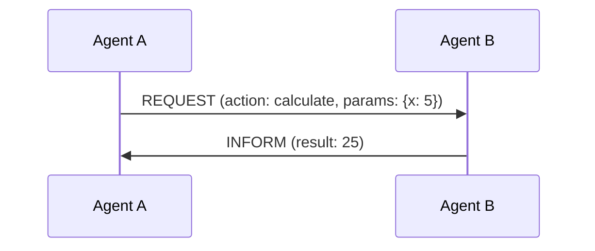
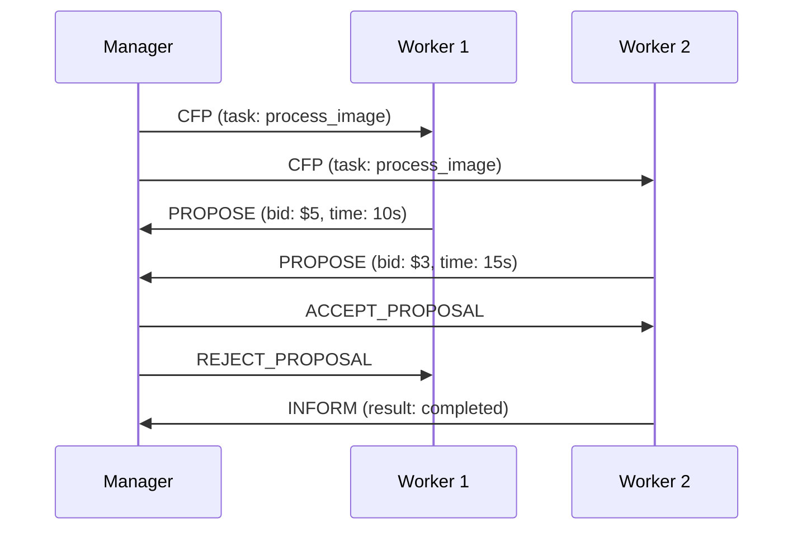

FIPA (Foundation for Intelligent Physical Agents) provides standardized
patterns for agent communication. While Caxton uses a pragmatic subset of FIPA
(see [ADR-0012](../adr/0012-pragmatic-fipa-subset.md)), understanding FIPA
concepts helps developers build better multi-agent systems.

This guide explains FIPA concepts in practical terms, focusing on what
developers need to know to work with Caxton.

## Quick Start: FIPA in 5 Minutes

### What is FIPA?

FIPA is a set of standards for how autonomous software agents communicate and
coordinate. Think of it as "HTTP for agents" - a common language that lets
different agents work together.

### Core Concept: Speech Acts

Agents communicate using "speech acts" - messages with specific intentions:

- **REQUEST**: "Please do X"
- **INFORM**: "Here's some information"
- **QUERY**: "Tell me about Y"
- **PROPOSE**: "I can do Z for price P"

### Basic Example

```json
{
  "performative": "request",
  "sender": "user-agent",
  "receiver": "weather-agent",
  "content": {
    "action": "get_forecast",
    "location": "Seattle"
  },
  "conversation_id": "weather-123"
}
```

## FIPA Concepts Explained

### 1. Performatives (Message Types)

#### What Caxton Uses

| Performative | Purpose | Example Use Case |
|--------------|---------|------------------|
| **REQUEST** | Ask agent to perform action | "Process this data" |
| **INFORM** | Share information | "Task completed" |
| **QUERY** | Ask for information | "What's the status?" |
| **PROPOSE** | Offer to do something | "I can handle this for $10" |
| **ACCEPT_PROPOSAL** | Accept an offer | "Yes, proceed" |
| **REJECT_PROPOSAL** | Decline an offer | "No, too expensive" |
| **FAILURE** | Report inability | "Cannot complete: disk full" |
| **NOT_UNDERSTOOD** | Message unclear | "Unknown action requested" |

#### Real-World Analogy

Think of performatives like email subject line prefixes:

- REQUEST = "Action Required:"
- INFORM = "FYI:"
- QUERY = "Question:"
- PROPOSE = "Proposal:"

### 2. Message Structure

#### Essential Fields

```rust
pub struct FIPAMessage {
    // What kind of message (request, inform, etc.)
    performative: Performative,

    // Who's sending
    sender: AgentId,

    // Who should receive
    receiver: AgentId,

    // The actual data/request
    content: serde_json::Value,

    // Groups related messages
    conversation_id: String,

    // For request-response pairing
    reply_with: Option<String>,
    in_reply_to: Option<String>,
}
```

#### Why These Fields Matter

- **conversation_id**: Links all messages in a workflow (like a support
  ticket number)
- **reply_with/in_reply_to**: Matches responses to requests (like email
  threading)
- **content**: Your actual data - Caxton uses JSON instead of FIPA's
  complex formats

### 3. Interaction Protocols

#### Request-Response Protocol

The most common pattern - one agent asks, another responds:



**Code Example**:

```rust
// Agent A sends request
let request = Message {
    performative: Performative::Request,
    content: json!({
        "action": "calculate",
        "params": {"x": 5}
    }),
    reply_with: Some("calc-123".to_string()),
    ..Default::default()
};

// Agent B responds
let response = Message {
    performative: Performative::Inform,
    content: json!({"result": 25}),
    in_reply_to: Some("calc-123".to_string()),
    ..Default::default()
};
```

#### Contract Net Protocol

For task distribution through bidding:



**When to Use**:

- Load balancing across agents
- Finding best agent for a task
- Resource allocation
- Service discovery

### 4. Agent Concepts

#### Agent Identity

Every agent has a unique identifier:

```rust
pub struct AgentId {
    name: String,        // e.g., "weather-agent"
    namespace: String,   // e.g., "production"
    version: String,     // e.g., "1.2.3"
}
```

#### Agent Capabilities

Agents advertise what they can do:

```rust
pub struct Capability {
    action: String,      // What the agent can do
    input_schema: Schema,  // Expected input format
    output_schema: Schema, // What it returns
    cost: Option<Cost>,    // Resource cost
}

// Example
Capability {
    action: "translate",
    input_schema: json_schema!({
        "text": "string",
        "from": "string",
        "to": "string"
    }),
    output_schema: json_schema!({
        "translated": "string"
    }),
    cost: Some(Cost::Credits(1)),
}
```

## Common Patterns in Practice

### Pattern 1: Service Request

```rust
// Client agent needs weather data
async fn get_weather(location: &str) -> Result<Weather> {
    let request = Message::request(
        "get_weather",
        json!({"location": location})
    );

    let response = send_and_wait(request).await?;

    match response.performative {
        Performative::Inform => Ok(serde_json::from_value(response.content)?),
        Performative::Failure => Err(Error::ServiceFailure(response.content)),
        _ => Err(Error::UnexpectedResponse),
    }
}
```

### Pattern 2: Asynchronous Processing

```rust
// Long-running task with progress updates
async fn process_large_file(file: &str) -> Result<()> {
    let conv_id = Uuid::new_v4().to_string();

    // Start processing
    send_message(Message {
        performative: Performative::Request,
        content: json!({"action": "process", "file": file}),
        conversation_id: conv_id.clone(),
        ..Default::default()
    }).await?;

    // Listen for progress updates
    let mut subscriber = subscribe_to_conversation(&conv_id).await?;

    while let Some(msg) = subscriber.next().await {
        match msg.performative {
            Performative::Inform if msg.content["status"] == "progress" => {
                println!("Progress: {}%", msg.content["percent"]);
            }
            Performative::Inform if msg.content["status"] == "complete" => {
                println!("Processing complete!");
                break;
            }
            Performative::Failure => {
                return Err(Error::ProcessingFailed(msg.content));
            }
            _ => {}
        }
    }

    Ok(())
}
```

### Pattern 3: Multi-Agent Coordination

```rust
// Coordinate multiple agents for complex task
async fn distributed_analysis(data: Data) -> Result<Report> {
    let conv_id = Uuid::new_v4().to_string();

    // Phase 1: Preprocessing
    let preprocessed = request_from_agent(
        "preprocessor",
        "clean_data",
        &data,
        &conv_id
    ).await?;

    // Phase 2: Parallel analysis
    let analyses = futures::join!(
        request_from_agent("statistical-analyzer", "analyze", &preprocessed, &conv_id),
        request_from_agent("ml-analyzer", "analyze", &preprocessed, &conv_id),
        request_from_agent("pattern-detector", "detect", &preprocessed, &conv_id),
    );

    // Phase 3: Combine results
    let report = request_from_agent(
        "report-generator",
        "generate",
        &(analyses.0?, analyses.1?, analyses.2?),
        &conv_id
    ).await?;

    Ok(report)
}
```

## FIPA vs Modern Approaches

### What FIPA Got Right

1. **Standardized communication** - Common language for agents
2. **Speech acts** - Clear message intentions
3. **Conversation tracking** - Related messages stay together
4. **Protocol patterns** - Reusable interaction templates

### What We Simplified

| FIPA Approach | Caxton Approach | Why |
|---------------|-----------------|-----|
| Complex ontologies (OWL/RDF) | JSON Schema | Better tooling, developer friendly |
| Semantic languages (FIPA-SL) | Plain JSON | Universal support |
| Many performatives (~22) | Essential 8 | Simpler mental model |
| Agent platforms (JADE) | Container orchestration | Cloud-native |
| Service discovery (DF/AMS) | Kubernetes/Consul | Modern infrastructure |

## Debugging FIPA Messages

### Common Issues and Solutions

#### Issue: Messages Not Received

```rust
// Check 1: Verify agent registration
let agents = orchestrator.list_agents().await?;
assert!(agents.contains(&receiver_id));

// Check 2: Verify routing
let route = orchestrator.get_route(&receiver_id).await?;
println!("Route to {}: {:?}", receiver_id, route);

// Check 3: Add message tracing
let mut message = create_message();
message.headers.insert("X-Trace-Id", Uuid::new_v4().to_string());
```

#### Issue: Conversation Confusion

```rust
// Always use unique conversation IDs
let conv_id = format!("{}-{}-{}",
    agent_id,
    operation,
    Uuid::new_v4()
);

// Track conversation state
pub struct ConversationTracker {
    conversations: HashMap<String, ConversationState>,
}

impl ConversationTracker {
    pub fn log_message(&mut self, msg: &Message) {
        let state = self.conversations
            .entry(msg.conversation_id.clone())
            .or_default();

        state.messages.push(msg.clone());
        state.last_updated = Instant::now();
    }
}
```

#### Issue: Protocol Mismatch

```rust
// Document expected protocols
#[derive(Debug)]
pub struct ProtocolSpec {
    name: String,
    steps: Vec<Step>,
    timeout: Duration,
}

pub struct Step {
    performative: Performative,
    from: Role,
    to: Role,
    required_fields: Vec<String>,
}

// Validate protocol compliance
fn validate_message(msg: &Message, expected: &Step) -> Result<()> {
    if msg.performative != expected.performative {
        return Err(Error::WrongPerformative);
    }

    for field in &expected.required_fields {
        if !msg.content.get(field).is_some() {
            return Err(Error::MissingField(field.clone()));
        }
    }

    Ok(())
}
```

## Best Practices

### 1. Message Design

```rust
// DO: Clear, self-contained messages
Message {
    performative: Performative::Request,
    content: json!({
        "action": "resize_image",
        "image_url": "https://...",
        "width": 800,
        "height": 600,
        "format": "jpeg"
    }),
    // ...
}

// DON'T: Ambiguous or stateful messages
Message {
    performative: Performative::Request,
    content: json!({
        "do": "that thing",
        "with": "the stuff from before"
    }),
    // ...
}
```

### 2. Error Handling

```rust
// Always handle failure responses
match response.performative {
    Performative::Inform => {
        // Success path
        process_result(response.content)
    }
    Performative::Failure => {
        // Extract error details
        let error = response.content["error"].as_str()
            .unwrap_or("Unknown error");
        let code = response.content["code"].as_u64();

        // Handle appropriately
        match code {
            Some(404) => Err(Error::NotFound),
            Some(500) => Err(Error::ServerError(error.to_string())),
            _ => Err(Error::Generic(error.to_string())),
        }
    }
    Performative::NotUnderstood => {
        // Message format issue
        Err(Error::ProtocolError("Message not understood"))
    }
    _ => {
        // Unexpected response
        Err(Error::UnexpectedResponse(response.performative))
    }
}
```

### 3. Conversation Management

```rust
// Use conversation IDs effectively
pub struct ConversationManager {
    timeout: Duration,
    cleanup_interval: Duration,
}

impl ConversationManager {
    pub fn start_conversation(&self, purpose: &str) -> Conversation {
        Conversation {
            id: format!("{}-{}", purpose, Uuid::new_v4()),
            started: Instant::now(),
            timeout: self.timeout,
            messages: Vec::new(),
        }
    }

    pub async fn cleanup_stale(&self) {
        // Remove old conversations periodically
    }
}
```

## Learning Resources

### Tutorials

1. [Building Your First FIPA Agent](../tutorials/first-fipa-agent.md)
2. [Implementing Contract Net Protocol](../tutorials/contract-net.md)
3. [Advanced Message Patterns](../tutorials/advanced-patterns.md)

### References

- [FIPA Specifications](http://www.fipa.org/repository/standardspecs.html) -
  Original specs (academic)
- [ADR-0003: FIPA Messaging Protocol](../adr/0003-fipa-messaging-protocol.md) -
  Why we chose FIPA
- [ADR-0012: Pragmatic FIPA Subset](../adr/0012-pragmatic-fipa-subset.md) -
  Our simplifications
- [Communication Patterns](communication-patterns.md) -
  Practical patterns

### Examples in Caxton Repository

- `examples/simple-request-response/` - Basic pattern
- `examples/contract-net/` - Bidding system
- `examples/multi-agent-workflow/` - Complex coordination
- `examples/error-handling/` - Robust error handling

## FAQ

### Q: Why use FIPA instead of REST/GraphQL?

**A**: FIPA provides:

- Conversation tracking across multiple messages
- Explicit message intentions (performatives)
- Proven patterns for agent coordination
- Decoupled, asynchronous communication

### Q: Do I need to learn all of FIPA?

**A**: No! Caxton uses only the useful parts. Focus on:

- The 8 core performatives
- Basic message structure
- Request-response pattern
- Contract net (if doing task distribution)

### Q: How is this different from message queues?

**A**: FIPA adds semantics:

- Messages have explicit meanings (performatives)
- Built-in conversation tracking
- Standard coordination protocols
- Agent-specific patterns

### Q: Can I use FIPA with existing services?

**A**: Yes! Create adapter agents:

```rust
pub struct RestAdapter {
    base_url: String,
}

impl RestAdapter {
    async fn handle_fipa(&self, msg: Message) -> Message {
        // Convert FIPA to REST
        let response = self.call_rest_api(&msg).await;

        // Convert back to FIPA
        Message::inform(response)
    }
}
```

## Summary

FIPA provides a time-tested foundation for agent communication. While the full
specification is complex, Caxton's pragmatic subset gives you:

- Clear communication patterns
- Standardized message formats
- Proven coordination protocols
- Extensible architecture

Focus on understanding performatives, message structure, and basic patterns.
The rest can be learned as needed.

Remember: **FIPA is just a tool** - the goal is building reliable,
maintainable multi-agent systems.
