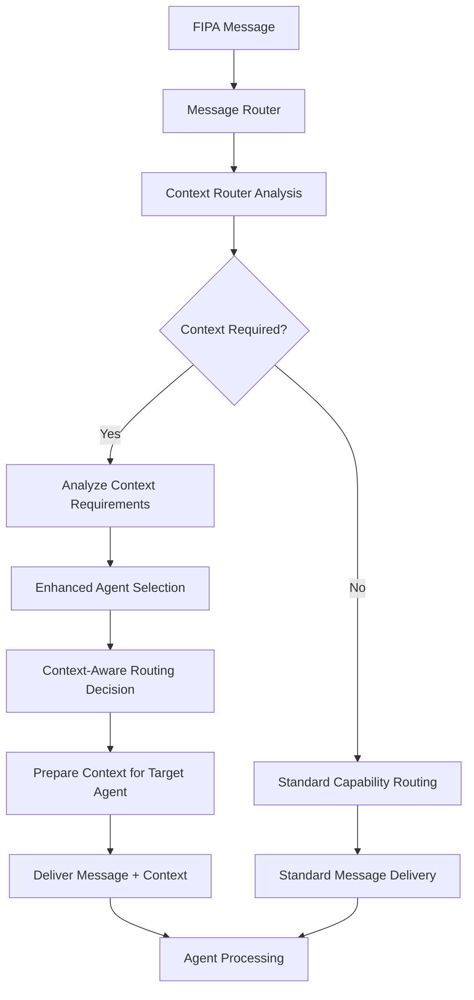

## Overview

Caxton's messaging system uses capability-based routing instead of direct
agent addressing. This approach promotes loose coupling, enables dynamic
scaling, and simplifies agent discovery. Instead of sending messages to specific
agents by name or ID, you request capabilities like "data-analysis" or
"report-generation".

## Core Concepts

### Capability Declaration

Configuration agents declare their capabilities in their YAML frontmatter:

```yaml
---
name: SalesAnalyzer
version: "1.0.0"
capabilities:
  - data-analysis
  - sales-reporting
  - chart-generation
tools:
  - http_client
  - csv_parser
---
```

### Capability Registry

The system maintains a dynamic registry that tracks:

- Which agents provide specific capabilities
- Agent availability and load status
- Capability metadata (performance characteristics, constraints)
- Version information for capability evolution

## Routing Strategies

### Single Recipient Routing

Routes messages to the best-matching agent for a capability based on:

- Current agent load
- Historical performance
- Capability specialization
- Geographic proximity (future)

**Example Use Case**: Critical data analysis requests that need guaranteed
single processing.

```yaml
# Message targeting single data analysis agent
performative: REQUEST
capability: data-analysis
routing_strategy: single_recipient
priority: high
content: "Analyze Q4 sales trends for anomalies"
```

### Broadcast Routing

Sends messages to all agents that provide a capability. Useful for:

- Information dissemination
- Consensus building
- Redundant processing for critical tasks

**Example Use Case**: Notifying all monitoring agents about system events.

```yaml
# Broadcast message to all monitoring capabilities
performative: INFORM
capability: system-monitoring
routing_strategy: broadcast
content: "System maintenance window starting at 02:00 UTC"
```

### Load Balancing

Distributes requests across capable agents using strategies:

- **Round-robin**: Simple cycling through available agents
- **Least-loaded**: Route to agent with lowest current workload
- **Performance-based**: Route based on historical response times
- **Capability-specific**: Use agent's specialized strengths

**Example Use Case**: Distributing data processing tasks across multiple workers.

```yaml
# Load balanced data processing request
performative: REQUEST
capability: data-processing
routing_strategy: load_balanced
load_algorithm: least_loaded
content: "Process customer dataset batch_2024_09_10"
```

## Practical Routing Examples

### Data Analysis Request

A configuration agent requests data analysis capability without knowing which
specific agents can provide it:

```yaml
# Requesting agent configuration
---
name: BusinessIntelligenceBot
capabilities:
  - business-intelligence
tools:
  - message_client
---

# Outgoing message structure
performative: REQUEST
capability: data-analysis
conversation_id: conv_20240910_001
reply_with: req_sales_analysis_001
content: |
  Please analyze the attached sales data for Q3 2024:
  - Identify top performing products
  - Calculate month-over-month growth rates
  - Flag any unusual patterns or anomalies

  Requirements:
  - Include executive summary
  - Provide visualization recommendations
  - Complete within 10 minutes

attachments:
  - sales_q3_2024.csv
```

The system routes this to any agent declaring "data-analysis" capability, such as:

```yaml
# Receiving agent configuration
---
name: AdvancedAnalyzer
capabilities:
  - data-analysis
  - statistical-modeling
  - visualization
tools:
  - pandas_processor
  - chart_generator
  - statistical_engine
---
```

### Multi-Stage Processing Pipeline

Complex workflows can route through multiple capabilities in sequence:

```yaml
# Stage 1: Data extraction
performative: REQUEST
capability: data-extraction
conversation_id: conv_pipeline_001
reply_with: extract_001
content: "Extract customer data from CRM system for last 30 days"

# Stage 2: Data cleaning (triggered by Stage 1 completion)
performative: REQUEST
capability: data-cleaning
conversation_id: conv_pipeline_001
in_reply_to: extract_001
reply_with: clean_001
content: "Clean extracted data: remove duplicates, standardize formats"

# Stage 3: Analysis (triggered by Stage 2 completion)
performative: REQUEST
capability: data-analysis
conversation_id: conv_pipeline_001
in_reply_to: clean_001
reply_with: analyze_001
content: "Perform customer segmentation analysis on cleaned data"
```

### Error Handling and Fallbacks

When no agents provide a requested capability:

```yaml
# System-generated failure response
performative: FAILURE
conversation_id: conv_20240910_001
in_reply_to: req_sales_analysis_001
content: |
  No agents available for capability: advanced-machine-learning

  Available related capabilities:
  - data-analysis (3 agents)
  - statistical-modeling (1 agent)
  - basic-ml-analysis (2 agents)

  Suggested alternatives:
  1. Use 'data-analysis' with statistical methods
  2. Break down request for 'basic-ml-analysis'
```

## Capability Evolution and Versioning

Capabilities can evolve over time with backward compatibility:

```yaml
# Agent supporting multiple capability versions
---
name: ModernAnalyzer
capabilities:
  - data-analysis:v1.0    # Legacy support
  - data-analysis:v2.0    # Current version
  - advanced-analytics:v1.0  # New capability
---
```

Version-specific routing:

```yaml
# Request specific capability version
performative: REQUEST
capability: data-analysis:v2.0
content: "Use new statistical methods for analysis"

# Fallback to any version if specific unavailable
performative: REQUEST
capability: data-analysis
fallback_versions: ["v2.0", "v1.0"]
content: "Analysis with best available methods"
```

## Advanced Routing Patterns

### Conditional Routing

Route based on message content or metadata:

```yaml
# Route large datasets to high-capacity agents
performative: REQUEST
capability: data-processing
routing_rules:
  - condition: "data_size > 100MB"
    strategy: "high_capacity_agents"
  - condition: "priority == 'urgent'"
    strategy: "fastest_agents"
  - default: "load_balanced"
```

### Geographic Routing

For distributed deployments (future enhancement):

```yaml
# Route to nearest datacenter
performative: REQUEST
capability: image-processing
routing_strategy: geographic
preferred_regions: ["us-west", "us-central"]
content: "Process satellite imagery dataset"
```

### Capability Composition

Request multiple capabilities to work together:

```yaml
# Coordinate multiple capabilities
performative: REQUEST
capabilities:
  - data-extraction
  - data-analysis
  - report-generation
coordination_mode: pipeline  # sequential execution
conversation_id: conv_composite_001
content: "Generate comprehensive sales report from CRM data"
```

## Best Practices

### Capability Naming Conventions

- Use kebab-case for capability names: `data-analysis`, `report-generation`
- Include domain specificity: `financial-analysis`, `medical-imaging`
- Avoid overlapping capabilities: prefer `customer-segmentation` over generic `analysis`

### Message Design for Capability Routing

- **Be specific about requirements**: Include data formats, constraints, timeouts
- **Provide context**: Help capable agents understand the business context
- **Include fallback options**: Specify alternative approaches if primary
  capability unavailable

### Agent Capability Declaration

- **Declare honestly**: Only list capabilities your agent can reliably fulfill
- **Include performance metadata**: Response time expectations, data size limits
- **Update dynamically**: Remove capabilities when agent becomes unavailable

### Monitoring and Debugging

The system provides introspection tools for capability routing:

```yaml
# Query available capabilities
performative: QUERY
capability: system:capabilities
content: "List all available capabilities and their providers"

# Debug routing decisions
performative: QUERY
capability: system:routing-debug
content: "Show routing decision for conversation conv_20240910_001"
```

## Context-Aware Routing Integration

### Context Management Architecture Integration

Capability-based routing integrates with the context management architecture
(ADR-0031) to provide intelligent, context-aware agent selection. When a FIPA
message targets a capability, the Context Router determines context
requirements and influences routing decisions based on contextual factors.

### Context-Enhanced Agent Selection

The capability registry maintains context-aware metadata for intelligent
routing decisions:

```yaml
# Enhanced Agent Registration with Context Capabilities
agent_registration:
  name: "SalesAnalyzer"
  capabilities:
    - data-analysis:v1.0
    - sales-reporting:v2.0
    - trend-forecasting:v1.0
  context_capabilities:
    conversation_continuity: excellent     # Maintains thread context well
    memory_integration: good               # Uses historical patterns
    context_window_size: large             # 32k tokens
    domain_specializations:
      - "sales_trends"
      - "customer_segmentation"
      - "seasonal_analysis"
    context_performance:
      avg_context_processing_ms: 45
      optimal_context_depth: 5
      max_context_depth: 10
```

### Context-Aware Routing Strategies

**Context Continuity Routing:**
Routes messages to agents that already have relevant conversation context,
improving response quality and reducing context preparation overhead.

```yaml
# Request routing with context continuity preference
performative: REQUEST
capability: data-analysis
conversation_id: conv_sales_analysis_001
reply_with: req_followup_001
content: |
  Based on our earlier analysis of Q3 trends, please extend the
  forecast to include seasonal adjustments for holiday sales.

routing_preferences:
  strategy: context_continuity
  context_weight: 0.8                     # High preference for context continuity
  performance_weight: 0.2                 # Lower weight for pure performance
  same_agent_preference: true             # Prefer agent from earlier messages
```

**Specialization-Context Matching:**
Matches message content semantically with agent domain specializations to
route to the most contextually appropriate agent.

```yaml
# Specialization-based routing
performative: REQUEST
capability: financial-analysis
conversation_id: conv_budget_review_001
reply_with: req_variance_001
content: |
  Analyze budget variance for operations department focusing on:
  - Overtime cost overruns in manufacturing
  - Equipment maintenance budget deviations
  - Supply chain cost fluctuations

routing_preferences:
  strategy: specialization_match
  required_specializations:
    - "budget_variance"
    - "operations_analysis"
  context_requirements:
    domain_expertise: "manufacturing_costs"
    memory_patterns: "variance_analysis"
```

**Context-Window Optimization:**
Routes complex, context-heavy requests to agents optimized for large context
windows while distributing simple requests for optimal performance.

```yaml
# Complex request requiring extensive context
performative: REQUEST
capability: strategic-planning
conversation_id: conv_strategy_session_001
reply_with: req_comprehensive_001
content: |
  Create comprehensive strategic plan incorporating our discussions from
  the past three planning sessions, market analysis from last month,
  competitive intelligence reports, and financial projections.

routing_preferences:
  strategy: context_optimized
  context_requirements:
    conversation_depth: 15               # Deep conversation history
    memory_search_results: 20            # Extensive historical patterns
    cross_conversation_refs: 3           # Reference other conversations
  minimum_context_window: 24000          # Require large context window
```

### Context Router Integration Flow

The Context Router intercepts routing decisions to enhance them with context
awareness:



### Context Performance Impact on Routing

Routing decisions consider context preparation performance to meet the <100ms
target from ADR-0031:

```yaml
# Performance-aware context routing
agent_context_metrics:
  name: "FastAnalyzer"
  context_performance:
    avg_context_prep_ms: 35              # Fast context preparation
    context_cache_hit_rate: 0.85         # High cache efficiency
    optimal_message_types: ["QUERY", "simple_REQUEST"]

  name: "DeepAnalyzer"
  context_performance:
    avg_context_prep_ms: 75              # Slower but thorough
    context_integration_quality: 0.95    # Excellent context utilization
    optimal_message_types: ["complex_REQUEST", "multi_turn_conversations"]

# Routing decision factors in performance trade-offs
routing_decision:
  message_complexity: high
  context_requirements: extensive
  performance_priority: balanced
  selected_agent: "DeepAnalyzer"        # Quality over speed for complex tasks
  estimated_total_latency_ms: 95        # Within target
```

## Integration with Configuration Agents

Configuration agents automatically participate in context-aware capability
routing through their runtime environment. The agent runtime handles:

- Capability registration from YAML frontmatter with context metadata
- Context-enhanced message routing and delivery
- Context preparation and injection into agent prompts
- Response formatting and correlation with conversation threads
- Error handling and fallback logic for context failures

### Agent Context Configuration

Configuration agents can specify their context preferences and capabilities:

```yaml
---
name: SalesAnalyzer
version: "1.0.0"
capabilities:
  - data-analysis
  - sales-reporting
  - chart-generation
context_configuration:
  conversation_memory: 10                 # Remember 10 previous messages
  domain_memory_search: true              # Use semantic search for patterns
  cross_conversation_refs: true           # Can reference other conversations
  context_window_preference: large        # Prefer detailed context
  specialization_keywords:
    - "sales trends"
    - "revenue analysis"
    - "customer segments"
tools:
  - http_client
  - csv_parser
---
```

Agents focus on their core functionality while the system handles the
complexity of context-aware capability discovery and intelligent routing.

## Performance Considerations

### Context-Enhanced Routing Overhead

**Traditional Routing Overhead:**

- Capability lookups: ~1-2ms for typical registries
- Load balancing decisions: ~0.5ms average
- Message serialization/deserialization: ~1-5ms depending on size

**Context-Aware Routing Additional Overhead:**

- Context requirement analysis: ~2-5ms
- Context-capability matching: ~3-8ms
- Context preparation coordination: ~1-3ms
- Total context-enhanced routing: ~7-18ms additional

**Performance Targets Integration:**

- Context preparation: <100ms (P95) from ADR-0031
- Total routing + context preparation: <105ms (P95)
- Context-aware routing represents <15% of total latency budget

### Scaling Characteristics

**Registry Scaling with Context Metadata:**

- **Registry size**: Linear lookup performance up to ~10,000 agents
- **Context metadata overhead**: ~2KB per agent (2x base registration)
- **Concurrent routing**: Handles ~800 context-aware routing decisions per
  second (reduced from 1,000 for basic routing)
- **Context cache hit rates**: 60-80% for conversation continuity patterns

**Context Performance Scaling:**

- **Conversation threads**: Optimal performance up to 50 active conversations
  per agent
- **Context window utilization**: Target >85% efficiency maintains
  sub-100ms preparation
- **Memory integration queries**: <10ms average for semantic search in
  routing decisions

### Optimization Tips

**Context-Aware Optimization:**

- Use specific capability names combined with context hints to reduce
  analysis overhead
- Group related capabilities with similar context requirements in single agents
- Cache context-enhanced routing decisions for repeated conversation patterns
- Pre-load context for agents with high conversation continuity preferences

**Performance Monitoring:**

- Monitor context preparation latency by capability type and complexity
- Track context cache hit rates and optimize for frequently accessed patterns
- Measure agent context utilization to identify over-contextualized routing
- Balance routing quality vs speed based on message priority and complexity

**Context Cache Strategies:**

- Cache prepared contexts for active conversation threads
- Pre-warm context for agents likely to be selected based on routing patterns
- Implement context degradation for performance-critical routing scenarios
- Use tiered context preparation (immediate vs complete context)

## Future Enhancements

### Context-Aware Smart Routing

Machine learning-based routing enhanced with context intelligence:

- **Context-Performance Learning**: Learn optimal agent-context combinations
  from historical success patterns
- **Conversation Pattern Recognition**: Identify conversation types and route
  based on optimal context requirements
- **Dynamic Context Optimization**: Adjust context depth and source selection
  based on real-time performance feedback
- **Semantic Capability Matching**: Use embedding-based matching between
  message content and agent specializations
- **Context Quality Scoring**: Rate context effectiveness and improve routing
  decisions based on outcome quality

### Context-Enhanced Capability Marketplace

Discovery and reputation system with context awareness:

- **Context-Specialized Ratings**: Separate ratings for different context
  scenarios (simple vs complex, single-turn vs multi-turn)
- **Context Performance Benchmarks**: Standardized metrics for context
  preparation speed and utilization efficiency
- **Context-Aware Cost Optimization**: Pricing models that account for context
  complexity and preparation overhead
- **Contextual Capability Discovery**: Find agents based on context
  requirements and conversation patterns
- **Context Expertise Reputation**: Track agent performance with specific
  types of contextual information

### Cross-Instance Context Routing

Route capabilities across multiple Caxton instances with context preservation:

- **Federated Context Registries**: Share context capabilities and performance
  metrics across instances
- **Inter-Instance Context Transfer**: Preserve conversation context when
  routing across instances
- **Distributed Context Load Balancing**: Balance context-heavy workloads
  across multiple instances
- **Context-Aware Instance Selection**: Route based on instance-specific
  context preparation capabilities and performance
- **Global Conversation Thread Management**: Maintain conversation continuity
  across distributed agent instances

### Advanced Context Integration Features

- **Predictive Context Pre-loading**: Anticipate context needs based on
  conversation patterns and pre-load relevant information
- **Context Compression and Summarization**: Intelligently compress context
  for agents with smaller context windows while preserving critical information
- **Multi-Modal Context Integration**: Support for image, audio, and document
  context in addition to text-based conversation history
- **Context Lifecycle Management**: Automated context cleanup, archival, and
  retrieval based on conversation importance and retention policies
- **Context Privacy and Security**: Fine-grained access control for sensitive
  context information with agent-level permissions
