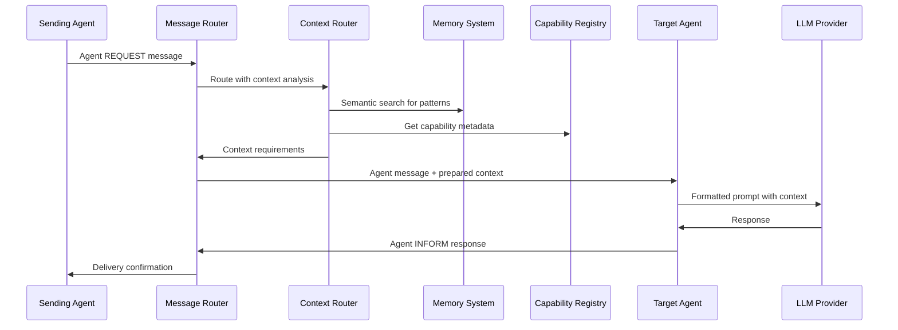

## Overview

Caxton implements a carefully selected subset of capability-based messaging
optimized for configuration-driven agents and integrated with the context management
architecture (ADR-0031). This messaging protocol provides standardized agent
communication while serving as a primary context source for intelligent
context preparation.

## Capability-Based Messaging Definition

### Supported Performatives (1.0)

**Communication Performatives:**

- `REQUEST` - Ask an agent to perform an action
- `INFORM` - Share information or report results
- `QUERY` - Request information without asking for action

**Negotiation Performatives:**

- `PROPOSE` - Suggest an action or value
- `ACCEPT_PROPOSAL` - Agree to a proposal
- `REJECT_PROPOSAL` - Decline a proposal

**Error Handling Performatives:**

- `FAILURE` - Indicate that a requested action failed
- `NOT_UNDERSTOOD` - Signal message comprehension failure

### Deferred Performatives (Post-1.0)

The following messaging performatives are intentionally deferred to maintain
simplicity for configuration agents in the 1.0 release:

- `CFP` (Call for Proposal) - Complex bidding protocol
- `CONFIRM` / `DISCONFIRM` - Confirmation protocols
- `CANCEL` - Message cancellation
- `SUBSCRIBE` / `INFORM_DONE` - Subscription-based messaging

## Context Management Integration

### Agent Messages as Context Sources

Agent messaging provides **conversation context** as one of four primary
context sources in the context management architecture:

1. **Conversation History** - Message threads and reply chains
2. **Semantic Memory** - Historical patterns from embedded memory system
3. **Capability Registry** - Agent capabilities and metadata
4. **MCP Tool Data** - Tool-specific context requirements

### Context Router Integration Flow

When an agent message arrives, the Context Router intercepts it to determine
context needs before agent processing:

```yaml
# Example: Agent REQUEST triggers context preparation
# 1. Agent Message Received
performative: REQUEST
capability: data-analysis
conversation_id: conv_analysis_001
reply_with: req_forecast_001
content: "Generate Q4 sales forecast based on current trends"

# 2. Context Router Analysis
# - Identifies target capability: data-analysis
# - Extracts conversation thread: conv_analysis_001
# - Determines context requirements from MCP tool specs
# - Gathers multi-source context within <100ms target

# 3. Contextual Agent Call
# - Agent receives agent message + prepared context
# - Context includes conversation history, relevant patterns, tool data
# - Agent generates contextually-aware response
```

### Conversation Context Contribution

Agent conversations serve as **immediate context** (highest priority) in the
hierarchical context system:

**Context Priority Levels:**

1. **Immediate Context** (Agent conversation threads) - Highest priority
2. **Session Context** (Tool state, user preferences) - Medium priority
3. **Domain Context** (Capability knowledge, patterns) - Lower priority
4. **Historical Context** (Memory system patterns) - Background priority

**Conversation Thread Management:**

- Each `conversation_id` maintains context across multi-turn interactions
- Reply chains (`in_reply_to`, `reply_with`) preserve request-response context
- Thread-based context preservation ensures continuity in complex workflows

### Context-Aware Message Routing

The integration between agent messaging and context management enables
context-aware routing patterns:

```yaml
# Context-Enhanced Routing Example
performative: REQUEST
capability: financial-analysis
conversation_id: conv_budget_review_001
reply_with: req_variance_001
content: |
  Analyze budget variance for Q3 operations:
  - Compare actual vs planned expenses
  - Identify categories with >10% variance
  - Provide recommendations for Q4 adjustments

# Context Router Processing:
context_requirements:
  conversation_depth: 3    # Last 3 messages in thread
  memory_search:
    query_template: "budget analysis variance {{department}}"
    max_results: 5
  capability_info: true
  related_conversations: ["conv_budget_planning_001"]

# Routing Decision Enhanced by Context:
routing_strategy: context_aware
selection_criteria:
  - agent_specialization: "financial-analysis"
  - recent_context_overlap: 0.8
  - conversation_continuity: "preferred_same_agent"
```

## Performance Integration with Context Management

### Latency Targets

Agent message processing integrates with context management performance targets
from ADR-0031:

- **Context preparation**: <100ms (P95)
- **Message routing**: <5ms additional overhead
- **Total request-to-LLM latency**: <105ms (P95)
- **Token utilization efficiency**: >85% of available context window

### Context Flow Architecture

The complete flow from agent request to agent LLM call with context:



## Message Structure with Context Integration

### Enhanced Agent Message Format

Standard agent messages are enhanced with context metadata:

```yaml
# Core Agent Message Fields
performative: REQUEST | INFORM | QUERY | PROPOSE | ACCEPT_PROPOSAL |
              REJECT_PROPOSAL | FAILURE | NOT_UNDERSTOOD
capability: target-capability-name
conversation_id: unique-conversation-identifier
reply_with: unique-message-identifier      # Optional
in_reply_to: previous-message-identifier   # Optional
content: "Natural language message content"

# Context Integration Fields
context_hints:
  conversation_depth: number               # Messages to include in context
  memory_relevance: high | medium | low    # Semantic search priority
  tool_context_required: boolean           # Whether tool data needed
  capability_metadata: boolean             # Include capability information

# Standard Agent Message Metadata
protocol: agent-request | agent-inform | agent-query
language: english                          # Content language
ontology: caxton-1.0                      # Domain ontology
```

### Context-Aware Message Examples

**Data Analysis Request with Context Requirements:**

```yaml
performative: REQUEST
capability: data-analysis
conversation_id: conv_sales_trend_001
reply_with: req_analysis_001
content: |
  Continue our sales trend analysis from yesterday's discussion.
  Please analyze the new data and compare with the patterns we
  identified in the retail segment.

  Focus on:
  - Month-over-month changes in the categories we flagged
  - Regional variations in the declining product lines
  - Updated forecast based on seasonal adjustments we discussed

context_hints:
  conversation_depth: 5                    # Include 5 previous messages
  memory_relevance: high                   # Search for related patterns
  tool_context_required: true              # Include tool state/preferences
  capability_metadata: true                # Agent specializations

parameters:
  data_source: "sales_2024_q4_partial.csv"
  analysis_type: "trend_continuation"
  reference_conversation: "conv_sales_trend_001"
```

**Multi-Turn Context Preservation:**

```yaml
# Message 1: Initial request
performative: REQUEST
capability: financial-planning
conversation_id: conv_budget_planning_001
reply_with: req_budget_001
content: "Create budget plan for new product launch in Q1 2025"

# Message 2: Follow-up with preserved context
performative: QUERY
conversation_id: conv_budget_planning_001
in_reply_to: inform_budget_001
reply_with: query_detail_001
content: |
  Based on the budget you prepared, what would be the impact if we
  reduced marketing spend by 20% and reallocated to R&D?

context_hints:
  conversation_depth: 2                    # Include initial request + response
  memory_relevance: medium                 # Related budget patterns
  tool_context_required: true              # Financial modeling tools
```

## Context-Enhanced Capability Routing

### Context-Aware Agent Selection

The capability registry is enhanced with context-awareness metadata:

```yaml
# Agent Registration with Context Capabilities
agent_registration:
  name: "AdvancedFinancialAnalyst"
  capabilities:
    - financial-analysis:v2.0
    - budget-planning:v1.0
    - variance-analysis:v1.0
  context_capabilities:
    conversation_continuity: preferred      # Better with same agent
    memory_integration: excellent           # Uses historical patterns well
    context_window_size: large              # Handles more context
    specialization_domains:
      - "budget_variance"
      - "financial_forecasting"
      - "cost_optimization"
```

### Routing Strategies with Context

**Context-Continuity Routing:**

- Prefer agents who have participated in the conversation thread
- Route to agents with relevant conversation context already loaded
- Balance context continuity with load distribution

**Specialization-Context Matching:**

- Match message content with agent domain specializations
- Use semantic similarity between request and agent expertise
- Consider agent performance on similar contextual requests

**Context-Window Optimization:**

- Route complex, context-heavy requests to agents with large context windows
- Distribute simple requests to agents optimized for speed
- Consider token efficiency in agent selection

## Error Handling with Context Integration

### Context-Aware Error Responses

Error responses include context information to help with recovery:

```yaml
performative: FAILURE
conversation_id: conv_analysis_001
in_reply_to: req_complex_001
content: |
  Analysis failed due to insufficient context for complex request:
  - Request requires 10+ previous messages for context
  - Current conversation only has 2 messages
  - Missing domain-specific patterns from memory system

error:
  type: "insufficient_context"
  context_requirements:
    minimum_conversation_depth: 10
    current_conversation_depth: 2
    missing_context_sources: ["domain_patterns", "user_preferences"]
  recovery_suggestions:
    - "Provide more background information in request"
    - "Reference specific previous conversations"
    - "Break down complex request into simpler parts"
    - "Use INFORM messages to provide missing context"
```

### Context Preparation Failures

When context preparation fails, the system provides graceful degradation:

```yaml
performative: INFORM
conversation_id: conv_analysis_001
in_reply_to: req_analysis_001
content: |
  Analysis completed with reduced context:
  - Context preparation timed out after 150ms
  - Processed with conversation history only
  - Memory system patterns not available
  - Results may be less comprehensive than optimal

context_status:
  preparation_time_ms: 150
  target_time_ms: 100
  available_sources: ["conversation_history"]
  unavailable_sources: ["memory_patterns", "capability_metadata"]
  quality_score: 0.7                       # Reduced from target 0.9+
```

## Integration Testing and Validation

### Context Integration Test Scenarios

**Conversation Continuity Test:**

1. Start multi-turn conversation with REQUEST
2. Verify context accumulation across INFORM/QUERY exchanges
3. Confirm agent responses show awareness of conversation history
4. Validate context window optimization within token limits

**Cross-Capability Context Test:**

1. Route REQUEST to capability A for initial processing
2. Route follow-up REQUEST to capability B
3. Verify capability B receives relevant context from capability A interaction
4. Confirm cross-capability context transfer maintains thread coherence

**Context Performance Test:**

1. Measure context preparation latency for various message types
2. Validate <100ms target for P95 of context-enhanced FIPA messages
3. Confirm token utilization >85% for context-heavy conversations
4. Test graceful degradation when context preparation exceeds timeouts

### Monitoring and Observability

**Context-Enhanced Message Metrics:**

- Context preparation latency by message type
- Token utilization efficiency for context-enhanced messages
- Context source contribution ratios (conversation vs memory vs tools)
- Agent performance correlation with context quality scores

**Conversation Context Health:**

- Thread depth distribution and context window utilization
- Context continuity success rates across agent changes
- Memory integration effectiveness for recurring conversation patterns

## Best Practices for Context-Integrated Agent Messages

### Message Design Guidelines

1. **Provide Conversation Context**: Include references to previous
   discussions and relevant background information
2. **Specify Context Requirements**: Use context_hints to guide context
   preparation based on request complexity
3. **Design for Continuity**: Structure conversations to build context
   progressively across multiple turns
4. **Balance Context and Performance**: Consider token budget when
   requesting extensive context

### Agent Implementation Guidelines

1. **Leverage Conversation History**: Use conversation context to avoid
   asking for previously provided information
2. **Reference Context Sources**: Acknowledge when responses are based on
   conversation history vs. memory patterns vs. tool data
3. **Maintain Thread Coherence**: Ensure responses connect logically with
   conversation flow and context
4. **Handle Context Limitations**: Gracefully manage scenarios where
   context is incomplete or unavailable

### System Integration Guidelines

1. **Monitor Context Performance**: Track context preparation latency and
   effectiveness across different message patterns
2. **Optimize Context Sources**: Balance context richness with preparation
   speed based on actual usage patterns
3. **Tune Context Windows**: Adjust context depth and token allocation
   based on agent performance and user satisfaction metrics
4. **Plan Context Evolution**: Design context specifications to evolve
   with agent capabilities and user needs

## Implementation Status and Future Enhancements

**Current Implementation Status**: This documentation describes the capability-based
messaging architecture as integrated with the context management system
(ADR-0031). The implementation provides the messaging foundation for
context-aware configuration agents, with context preparation and routing
designed to meet the performance targets specified in the context management
architecture.

**Future Enhancements (Post-1.0):**

- Contract Net Protocol (CFP) with context-aware bidding
- Advanced negotiation patterns with context state management
- Cross-instance conversation context propagation
- Machine learning-based context optimization and agent-context matching
- Context caching and pre-loading for frequently accessed conversation patterns

The capability-based messaging implementation serves as both a robust messaging protocol
and a critical context source for intelligent agent interactions, enabling
configuration-driven agents to participate in sophisticated multi-turn
conversations with appropriate contextual awareness.
