# Message Router Component Interaction Diagrams

## Overview

This document presents detailed component interaction diagrams showing how MessageRouter, DeliveryEngine, ConversationManager, and AgentRegistry components collaborate to provide high-performance message routing in the Caxton system.

## Message Flow Diagrams

### 1. Happy Path: Local Agent Message Routing

```mermaid
sequenceDiagram
    participant C as Client
    participant MR as MessageRouter
    participant AR as AgentRegistry
    participant CM as ConversationManager
    participant DE as DeliveryEngine
    participant LA as LocalAgent
    participant OT as OpenTelemetry

    Note over C,OT: Fast Path: Local Agent Message (< 1ms target)

    C->>+MR: route_message(FipaMessage)
    MR->>OT: start_span("message_route")
    MR->>MR: validate_message()

    MR->>+AR: lookup(receiver_agent_id)
    Note over AR: O(1) HashMap lookup
    AR-->>-MR: AgentLocation::Local(agent)

    par Conversation Management
        MR->>+CM: get_or_create_conversation(conv_id, participants)
        Note over CM: O(1) DashMap lookup or creation
        CM-->>-MR: Conversation
        MR->>CM: update_conversation(conv_id, message)
    and Message Delivery
        MR->>+DE: deliver_local(message, agent)
        DE->>DE: check_agent_availability()
        DE->>+LA: message_queue.send(message)
        LA-->>-DE: Ok(())
        DE-->>-MR: MessageId
    end

    MR->>OT: record_metrics(success, duration)
    MR-->>-C: Ok(MessageId)

    Note over C,OT: Total time: ~200-800μs for local delivery
```

### 2. Remote Agent Message Routing

### 3. Agent Discovery Flow (Unknown Agent)

### 4. High-Throughput Batch Processing

## Component State Management

### 5. Agent Registration Lifecycle

### 6. Circuit Breaker State Transitions

## Error Handling Flows

### 7. Comprehensive Error Handling

## Performance Optimization Flows

### 8. Cache Management Strategy

## Monitoring and Observability

### 9. OpenTelemetry Integration Flow

## Configuration and Deployment Flows

### 10. Dynamic Configuration Updates

## Summary

These component interaction diagrams illustrate:

1. **Message Routing Flows**: Fast local delivery, remote routing with fault tolerance, and agent discovery
2. **State Management**: Agent lifecycle and circuit breaker state transitions
3. **Error Handling**: Comprehensive error recovery with retries, circuit breaking, and dead letter queues
4. **Performance Optimization**: Multi-level caching with adaptive TTL and predictive warming
5. **Observability**: Complete telemetry integration with traces, metrics, and structured logging
6. **Configuration Management**: Hot-reload capabilities with validation and rollback

The diagrams demonstrate how the components collaborate to achieve:
- **Sub-millisecond local routing** (< 1ms target)
- **Fast remote routing** (< 5ms target)
- **High throughput processing** (100K+ messages/second)
- **Comprehensive fault tolerance** with graceful degradation
- **Complete observability** for operational excellence

This architecture provides the foundation for reliable, scalable message routing in the Caxton multi-agent system.
