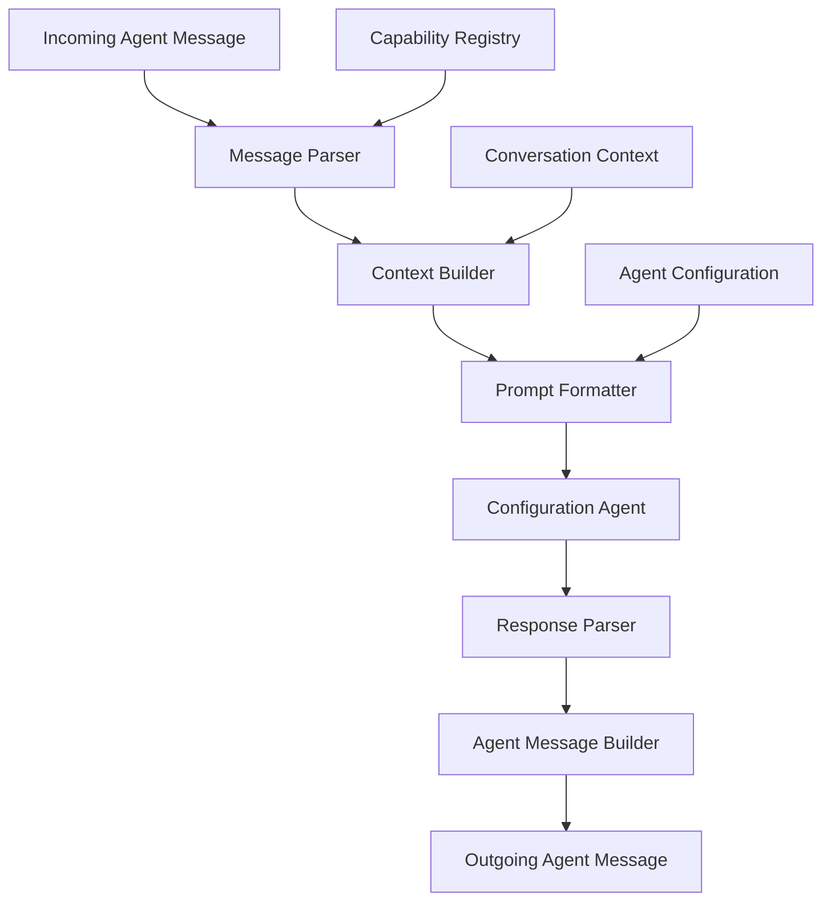

## Overview

Configuration agents (defined through TOML configuration files) participate in
Caxton's agent messaging system through intelligent runtime integration.
The system automatically translates between structured agent messages and
natural language prompts that configuration agents can understand and respond
to effectively.

## Runtime Integration Architecture

### Message Processing Pipeline

When an agent message is routed to a configuration agent, the runtime
performs several transformation steps:



1. **Message Parser**: Extracts agent message performative, content, and metadata
2. **Context Builder**: Integrates with Context Router (ADR-0031) to gather
   multi-source context including conversation history, semantic memory
   patterns, and tool-specific data
3. **Prompt Formatter**: Creates natural language prompt with prepared
   context following agent's template
4. **Configuration Agent**: Processes the context-enhanced prompt using LLM
   capabilities
5. **Response Parser**: Extracts agent message performative and structured data from
   response
6. **Message Builder**: Constructs properly formatted agent response message

### Agent Configuration for Messaging

Configuration agents specify messaging behavior through their TOML configuration:

```toml
name = "CustomerSupportAgent"
version = "1.0.0"
capabilities = [
  "customer-support",
  "order-tracking",
  "billing-inquiries"
]

# Tools for messaging operations
tools = [
  "message_client",      # For sending messages
  "customer_database",   # For looking up customer info
  "order_system"         # For tracking orders
]

# Messaging configuration
[messaging]
auto_respond = true                    # Automatically respond to capability requests
conversation_timeout = "2h"            # Custom timeout for support conversations
max_conversation_length = 20           # Limit conversation turns
context_window = 8                     # Messages to include in context
response_format = "structured"         # structured|natural|hybrid

# Prompt templates for different message types
[prompt_templates]
request_handler = '''
You are handling a customer service request.

Request: {{message_content}}
Customer Context: {{customer_info}}
Conversation History: {{conversation_summary}}

Provide helpful, accurate assistance. If you need to perform actions,
use your available tools. Format your response to include:
- Direct answer to the customer's question
- Any actions you took
- Next steps if applicable
'''

query_handler = '''
Answer this information request about {{capability}}:

Question: {{message_content}}
Available Data: {{context_data}}

Provide a clear, factual response based on available information.
'''

inform_handler = '''
You received this information update:

Information: {{message_content}}
Source: {{sender_agent}}

Acknowledge receipt and indicate any actions you will take based on
this information.
'''

system_prompt = '''
You are a customer support specialist who helps customers with orders,
billing, and general inquiries.
You have access to customer databases and order systems. Always be
helpful, professional, and accurate.

When participating in conversations, maintain context and refer to
previous interactions appropriately.
If you cannot help with something, politely explain your limitations
and suggest alternatives.
'''

documentation = '''
# CustomerSupportAgent

This agent handles customer service inquiries including order tracking,
billing questions, and general support requests.

## Capabilities

- **customer-support**: General customer service inquiries
- **order-tracking**: Track order status and delivery information
- **billing-inquiries**: Help with billing questions and payment issues

## Usage Examples

Ask me to:
- "Check the status of order #12345"
- "Help resolve a billing discrepancy"
- "Explain our return policy"
'''
```

## Message Transformation Examples

### REQUEST Message Processing

**Incoming Agent Message:**

```yaml
performative: REQUEST
capability: customer-support
conversation_id: conv_support_001
reply_with: req_order_help_001
sender: WebChatBot
content: |
  Customer needs help with order tracking:
  - Order ID: ORD-2024-091005
  - Customer email: john.doe@email.com
  - Issue: Order shows delivered but customer hasn't received it
  - Customer is frustrated and wants immediate resolution

customer_context:
  email: "john.doe@email.com"
  order_id: "ORD-2024-091005"
  previous_orders: 12
  customer_tier: "premium"
  issue_priority: "high"
```

**Generated Prompt for Configuration Agent:**

```yaml
# System automatically creates this prompt
system_context: |
  You are a customer support specialist handling a high-priority customer issue.
  Customer Profile: john.doe@email.com (Premium tier, 12 previous orders)

user_prompt: |
  CUSTOMER SERVICE REQUEST (High Priority)

  Customer Issue: Order tracking problem
  - Order ID: ORD-2024-091005
  - Customer: john.doe@email.com (Premium customer)
  - Problem: Order shows delivered but not received
  - Customer mood: Frustrated, wants immediate resolution

  Please help this customer by:
  1. Looking up detailed order information
  2. Checking delivery status and carrier details
  3. Identifying what went wrong
  4. Proposing immediate solutions

  Use your order_system tool to get current information.
  This is a premium customer - provide excellent service.

conversation_context: |
  This is the start of a new customer support conversation.
  Priority: High (frustrated premium customer)
```

**Agent Response Processing:**

```yaml
# Configuration agent's response
agent_response: |
  I've looked up order ORD-2024-091005 and found the issue. The order was marked as "delivered" by FedEx yesterday at 2:15 PM to "front door," but our tracking shows some concerning details:

  ORDER DETAILS:
  - Shipped: September 8th via FedEx Ground
  - Tracking: 7749123456789
  - Marked delivered: September 9th, 2:15 PM
  - Delivery location: "Front door"
  - Signature: Not required (concerning for $340 order)

  ISSUE IDENTIFIED:
  The package was delivered without signature confirmation despite the high value. FedEx shows "left at front door" which is not our policy for orders over $100.

  IMMEDIATE ACTIONS TAKEN:
  1. Filed delivery investigation with FedEx (Case #DEL-2024-091001)
  2. Initiated shipment replacement for overnight delivery
  3. Upgraded customer account to require signature for all future deliveries
  4. Applied $25 service credit for the inconvenience

  NEXT STEPS:
  - Replacement order ships today, arrives tomorrow by 10:30 AM
  - FedEx will investigate and contact customer within 24 hours
  - Customer will receive tracking info for replacement via email shortly

  I understand your frustration, Mr. Doe, and I sincerely apologize for this delivery issue. As a premium customer, you deserve better service, and we've taken immediate action to make this right.
```

**Generated Agent Response Message:**

```yaml
performative: INFORM
conversation_id: conv_support_001
in_reply_to: req_order_help_001
sender: CustomerSupportAgent
content: |
  Customer issue resolved with immediate action taken:

  PROBLEM: Order ORD-2024-091005 marked delivered but not received by customer
  ROOT CAUSE: FedEx delivered without signature despite high value ($340)

  RESOLUTION ACTIONS:
  - Filed FedEx investigation (Case #DEL-2024-091001)
  - Replacement order initiated for overnight delivery
  - Account upgraded to require signatures
  - $25 service credit applied

  CUSTOMER COMMUNICATION:
  Customer informed of all actions and timeline. Replacement arrives tomorrow by 10:30 AM.

resolution_data:
  issue_type: "delivery_failure"
  resolution_time_minutes: 8
  customer_satisfaction_expected: "high"
  financial_impact:
    replacement_cost: 340.00
    expedited_shipping: 25.00
    service_credit: 25.00
    total_cost: 390.00
  follow_up_required: true
  follow_up_date: "2024-09-11T12:00:00Z"
```

### QUERY Message Processing

**Incoming Agent Message:**

```yaml
performative: QUERY
capability: order-tracking
conversation_id: conv_inquiry_002
reply_with: query_bulk_orders_001
content: |
  Need information about bulk order processing:
  - How long do orders of 100+ items typically take to process?
  - What is the maximum order size we can handle?
  - Are there special pricing tiers for bulk orders?
  - What documentation is required for orders over $10k?

query_context:
  requester_type: "sales_team"
  customer_type: "enterprise_prospect"
  urgency: "medium"
```

**Generated Prompt:**

```yaml
system_context: |
  You are answering questions about order processing capabilities.
  This is for a sales team member helping an enterprise prospect.

user_prompt: |
  INFORMATION REQUEST: Bulk Order Processing

  The sales team needs details about our bulk order capabilities for an enterprise prospect:

  Questions:
  1. Processing time for orders of 100+ items?
  2. Maximum order size we can handle?
  3. Special bulk pricing tiers available?
  4. Documentation requirements for $10k+ orders?

  Context: Enterprise prospect evaluation
  Urgency: Medium

  Please provide accurate, complete information that will help close this enterprise deal.
  Use your order_system tool to get current processing capabilities and policies.
```

### PROPOSE Message Processing

**Incoming Agent Message:**

```yaml
performative: PROPOSE
capability: billing-inquiries
conversation_id: conv_billing_003
reply_with: prop_payment_plan_001
content: |
  Customer has past due balance and requesting payment arrangement:

  Customer: Sarah Johnson (CUST-789012)
  Outstanding balance: $2,847.50
  Days overdue: 45

  Customer proposal:
  - Pay $500 immediately
  - Remaining $2,347.50 over 6 months ($391.25/month)
  - Requests waiver of late fees ($125)

  Customer cites financial hardship due to medical expenses.

proposal_context:
  customer_history: "generally_good"
  payment_history: "typically_on_time"
  account_age: "3_years"
  risk_assessment: "low_to_medium"
```

**Configuration Agent Response:**

```yaml
# Agent evaluates the proposal and responds
performative: ACCEPT_PROPOSAL
conversation_id: conv_billing_003
in_reply_to: prop_payment_plan_001
content: |
  Payment plan proposal ACCEPTED with modifications:

  APPROVED TERMS:
  - Immediate payment: $500 (confirmed)
  - Remaining balance: $2,347.50 over 6 months
  - Monthly payments: $391.25 (auto-pay required)
  - Late fee waiver: $125 (approved due to hardship)

  ACCOUNT ACTIONS TAKEN:
  1. Created payment plan agreement (PLAN-2024-091001)
  2. Waived $125 in late fees
  3. Set up automatic monthly payments
  4. Placed account on payment plan status (collections suspended)
  5. Scheduled payment reminders

  NEXT STEPS:
  - Customer must make $500 payment within 48 hours to activate plan
  - Auto-pay begins October 1st for first $391.25 payment
  - Account will be reviewed for good standing after 3 payments

  This arrangement balances customer hardship with business needs while maintaining our relationship with a generally reliable customer.

payment_plan_details:
  plan_id: "PLAN-2024-091001"
  immediate_payment: 500.00
  monthly_amount: 391.25
  payment_count: 6
  late_fees_waived: 125.00
  auto_pay_required: true
  first_payment_date: "2024-10-01"
  activation_deadline: "2024-09-12T23:59:59Z"
```

## Context Management Integration

### Context-Enhanced Message Processing

Configuration agents benefit from intelligent context management (ADR-0031)
that automatically gathers relevant information from multiple sources to
provide contextual awareness without requiring manual prompt engineering.

#### Context Sources for Configuration Agents

**Primary Context Sources:**

1. **Conversation History** - Previous messages in the current thread
2. **Semantic Memory** - Historical patterns from embedded memory system
3. **Tool Data** - Current tool state and user preferences
4. **Capability Metadata** - Agent specializations and performance data

#### Context-Enhanced Prompt Generation

The Context Builder integrates with the Context Router to create
intelligent prompts that include relevant contextual information:

```yaml
# Example: Context-enhanced prompt for customer support agent
system_context: |
  You are a customer support specialist. Based on the conversation history
  and customer profile, this customer (john.doe@email.com) is a premium
  tier customer with 12 previous orders and generally positive interactions.

  Recent conversation context:
  - Customer reported delivery issue with order ORD-2024-091005
  - You initiated replacement shipment with overnight delivery
  - Customer expressed satisfaction with quick resolution
  - This is a follow-up inquiry about the replacement order

user_prompt: |
  FOLLOW-UP INQUIRY (Context: Previous delivery resolution)

  Customer: john.doe@email.com (Premium - satisfied with previous resolution)
  Current request: "Hi, I wanted to check on the status of my replacement
  order. You mentioned it would arrive today with overnight shipping."

  Context from memory:
  - Original issue: Order ORD-2024-091005 marked delivered but not received
  - Resolution: Replacement order placed with overnight shipping
  - Customer mood: Initially frustrated, became satisfied after resolution
  - Replacement tracking: Should be available in system

  Please help with this follow-up inquiry using the context above.

context_metadata:
  conversation_depth: 3                    # 3 previous messages included
  memory_patterns: ["delivery_issues", "premium_customer_service"]
  context_preparation_ms: 67               # Sub-100ms target met
  context_sources: ["conversation", "customer_profile", "order_history"]
```

#### Context Performance Integration

Configuration agents participate in the <100ms context preparation target:

**Context Preparation Performance:**

- **Message analysis**: 5-15ms to determine context requirements
- **Multi-source gathering**: 30-70ms for conversation + memory + tools
- **Context formatting**: 10-20ms to create agent-specific prompts
- **Total context preparation**: <100ms (P95) as specified in ADR-0031

**Context Quality Metrics:**

- **Token utilization**: >85% efficiency target for context window usage
- **Context relevance**: Semantic similarity scoring for included information
- **Response quality**: Improved responses with appropriate context vs without

#### Context Configuration Options

Configuration agents can specify context preferences in their TOML configuration:

```toml
name = "AdvancedSalesAgent"
capabilities = [
  "lead-qualification",
  "technical-consultation"
]
domain_specializations = [
  "enterprise_sales",
  "technical_requirements",
  "solution_architecture"
]

[context_requirements]
conversation_depth = 8                    # Include 8 previous messages
cross_conversation_refs = true            # Reference related conversations
context_window_preference = "large"       # Optimize for detailed context

[context_requirements.memory_search]
query_template = "sales {{lead_industry}} {{conversation_topic}}"
max_results = 10
relevance_threshold = 0.7

[context_requirements.tool_context]
include = [
  "lead_database_state",
  "crm_customer_profile",
  "pricing_calculator_cache"
]
```

### Context-Aware Agent Behavior

Configuration agents leverage context to provide more intelligent responses:

**Context-Informed Response Patterns:**

- **Reference previous interactions**: "As we discussed earlier..."
- **Build on conversation history**: "Based on the analysis I provided
  yesterday..."
- **Use customer/user patterns**: "Given your preference for detailed
  reports..."
- **Apply domain knowledge**: "For enterprise clients like yours, we
  typically recommend..."

**Context Degradation Handling:**
When context preparation exceeds performance targets, agents receive
degraded context with clear indicators:

```yaml
context_status:
  preparation_time_ms: 120                 # Exceeded 100ms target
  available_sources: ["conversation_history"]
  unavailable_sources: ["memory_patterns", "tool_state"]
  quality_indicator: "reduced_context"     # Agent knows context is limited
```

## Advanced Integration Patterns

### Context-Aware Multi-Agent Collaboration

Configuration agents can coordinate with other agents in conversations:

```yaml
# Sales agent receives lead qualification request
performative: REQUEST
capability: lead-qualification
conversation_id: conv_sales_pipeline_001
content: |
  New enterprise lead needs qualification:
  - Company: TechCorp Industries
  - Contact: Mike Chen, IT Director
  - Interest: Multi-region deployment (500+ users)
  - Timeline: Q1 2025 implementation
  - Budget indication: $50k-100k range

# Sales agent requests technical consultation
performative: REQUEST
capability: technical-consultation
conversation_id: conv_sales_pipeline_001
reply_with: req_tech_analysis_001
content: |
  Need technical analysis for TechCorp lead:
  - 500+ users across multiple regions
  - Existing infrastructure: AWS, microservices
  - Integration needs: Salesforce, ServiceNow, Slack
  - Compliance requirements: SOX, PCI DSS
  - Performance requirements: <200ms response time

  Questions:
  1. Can our platform scale to their requirements?
  2. What infrastructure recommendations?
  3. Integration complexity assessment?
  4. Estimated implementation timeline?

# Technical consultant responds with analysis
performative: INFORM
conversation_id: conv_sales_pipeline_001
in_reply_to: req_tech_analysis_001
content: |
  Technical analysis for TechCorp opportunity:

  SCALABILITY ASSESSMENT:
  ✅ Platform supports 500+ concurrent users
  ✅ Multi-region deployment fully supported
  ✅ Auto-scaling handles usage spikes

  INFRASTRUCTURE RECOMMENDATIONS:
  - AWS deployment in US-East, US-West, EU-West regions
  - Minimum: 3 application nodes per region
  - Database: RDS Multi-AZ with read replicas
  - Estimated monthly infrastructure: $8,500

  INTEGRATION COMPLEXITY:
  - Salesforce: Standard (2-3 weeks)
  - ServiceNow: Moderate (3-4 weeks)
  - Slack: Simple (1 week)
  - Overall integration timeline: 6-8 weeks

  COMPLIANCE READINESS:
  ✅ SOX compliant (annual audit passed)
  ✅ PCI DSS Level 1 certification current
  ✅ SOC 2 Type II report available

  PERFORMANCE PROJECTIONS:
  - Expected response time: 50-120ms (well under 200ms requirement)
  - 99.9% uptime SLA available

  RECOMMENDATION: Strong technical fit. Proceed with detailed proposal.

# Sales agent follows up with proposal request
performative: REQUEST
capability: proposal-generation
conversation_id: conv_sales_pipeline_001
reply_with: req_proposal_001
content: |
  Generate comprehensive proposal for TechCorp based on technical analysis:

  Include:
  - Technical architecture recommendations
  - Implementation timeline (6-8 weeks integration + 2 weeks testing)
  - Infrastructure costs ($8,500/month) + platform licensing
  - Professional services estimate
  - Compliance certifications and SLAs
  - Success metrics and ROI projections

  Target proposal value: $85,000 initial + $25,000/month ongoing
```

### Error Handling and Recovery

Configuration agents handle error scenarios through natural language:

```yaml
# Agent receives a request it cannot fulfill
performative: REQUEST
capability: advanced-analytics
conversation_id: conv_analytics_001
reply_with: req_ml_analysis_001
content: |
  Please perform machine learning analysis on customer behavior data:
  - Build predictive model for churn risk
  - Use advanced algorithms (neural networks, ensemble methods)
  - Provide model accuracy metrics and feature importance
  - Generate actionable insights for retention strategies

# Agent recognizes its limitations and responds appropriately
performative: FAILURE
conversation_id: conv_analytics_001
in_reply_to: req_ml_analysis_001
content: |
  I cannot fulfill this advanced machine learning request due to
  capability limitations:

  ISSUE: Request requires advanced ML algorithms beyond my current tools
  - My data-analysis capability covers statistical analysis and basic modeling
  - Neural networks and ensemble methods require specialized ML platforms
  - I lack access to advanced ML libraries and compute resources

  ALTERNATIVE SOLUTIONS:
  1. I can perform statistical analysis to identify churn indicators
  2. Route request to 'machine-learning' capability (if available)
  3. Provide data preparation and basic predictive modeling

  RECOMMENDED APPROACH:
  Let me handle data preparation and initial analysis, then coordinate
  with a specialized ML agent for the advanced modeling work.

  Would you like me to:
  - Start with statistical churn analysis?
  - Route to machine learning specialists?
  - Break down the request into manageable components?

failure_details:
  error_type: "capability_limitation"
  requested_capability: "advanced-ml-modeling"
  available_capability: "statistical-analysis"
  suggested_alternatives: ["basic_modeling", "route_to_ml_specialist",
    "data_preparation"]
```

## Performance Optimization

### Context Management

Configuration agents can optimize context usage for better performance:

```toml
name = "HighVolumeAgent"

[messaging.context_optimization]
summarize_long_conversations = true    # Auto-summarize after 10 messages
max_context_tokens = 4000             # Limit context size
context_compression = "intelligent"    # Remove less relevant messages
preserve_key_messages = true          # Always keep REQUEST/INFORM pairs
```

### Response Caching

Agents can cache common responses:

```toml
name = "FAQAgent"

[messaging.response_caching]
enabled = true
cache_duration = "1h"                 # Cache responses for 1 hour
cache_key_includes = ["content", "capability"]  # Cache based on content
cache_common_queries = true           # Cache FAQ-type responses
```

### Batch Processing

Handle multiple related messages efficiently:

```toml
name = "BulkProcessingAgent"

[messaging.batch_processing]
enabled = true
max_batch_size = 10                   # Process up to 10 messages together
batch_timeout = "30s"                 # Wait up to 30 seconds to form batches
batch_similar_requests = true         # Group similar request types
```

## Best Practices for Configuration Agent Messaging

### Prompt Template Design

1. **Include clear context**: Help agents understand their role and the
   situation
2. **Provide structured information**: Use consistent formatting for data
3. **Set clear expectations**: Specify what kind of response is needed
4. **Include conversation context**: Reference previous interactions when
   relevant

### Response Parsing

1. **Use structured sections**: Format responses with clear headers and sections
2. **Include metadata**: Provide structured data alongside natural language
3. **Handle ambiguity**: Train agents to ask clarifying questions when uncertain
4. **Format for automation**: Structure responses so other agents can parse them

### Error Handling

1. **Graceful degradation**: Provide partial responses when complete
   fulfillment isn't possible
2. **Clear error communication**: Explain exactly what went wrong and why
3. **Suggest alternatives**: Offer different approaches when the primary
   request fails
4. **Escalate appropriately**: Know when to route requests to more capable
   agents

### Performance Considerations

1. **Optimize context windows**: Balance context richness with processing speed
2. **Use appropriate timeouts**: Set realistic expectations for response times
3. **Cache common responses**: Avoid reprocessing identical requests
4. **Monitor resource usage**: Track agent performance and scale as needed

Configuration agents provide a powerful, accessible way to participate in
sophisticated messaging workflows while maintaining the simplicity and
flexibility that makes them easy to develop and deploy. Through intelligent
runtime integration, they can engage in complex multi-agent conversations
while remaining fundamentally based on natural language and TOML
configuration.
